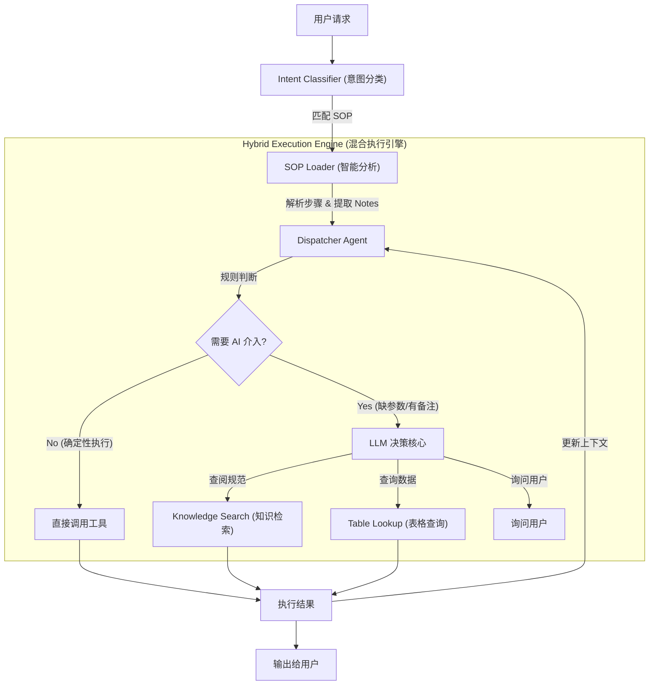

# 📦 PicoAgent: 工程师的 AGI 助手

**小模型SLM + 经验库SOPs + 工程工具EngTools + 地理世界GeoWorld ≈ 工程师AGI（过程可控的企业级Agent打工人）**

---

## 1. 项目愿景 (Vision)

PicoAgent是一个**过程可控的企业级Agent打工人**，专为工程、设计等严谨行业打造。通过结合小型语言模型 (SLM)、标准作业程序 (SOPs) 、工程设计类工具（EngTools）和地理世界 (GeoWorld) 数据，为工程师提供高度确定性的自动化工具，显著提升生产力。

### 核心理念
- **Human Defines SOP, Agent Executes Tasks** (人定流程，Agent执行)
- **确定性执行(Deterministic)**: 反“智能涌现”和幻觉，严格遵循企业既定的标准作业程序。

---

## 2. 核心架构 (Architecture)

### 2.1 混合调度架构 (Hybrid Flow)



### 2.2 核心模块说明

- **[classifier.py](/AI/PicoAgent/backend/src/agents/classifier.py)**: 意图分类器。负责识别用户意图并匹配最合适的 SOP。
- **[dispatcher.py](/AI/PicoAgent/backend/src/agents/dispatcher.py)**: 核心调度引擎。根据 SOP 步骤控制执行流，决定是直接运行工具还是调用 LLM。
- **[sop_loader.py](/AI/PicoAgent/backend/src/core/sop_loader.py)**: 智能加载器。将 Markdown 格式的 SOP 转换为结构化步骤，并利用 LLM 提取关键约束和输入要求。
- [llm.py](/AI/PicoAgent/backend/src/core/llm.py): LLM 客户端封装。集成主流AI模型，支持多模型切换和双语处理。
- [memory.py](/AI/PicoAgent/backend/src/core/memory.py): 上下文与记忆管理。分层存储全局上下文、步骤历史和工作记忆。

---

## 3. 功能亮点 (Features)

1.  **SOP确定性执行**: 自然语言描述的主观经验库，确保强执行力。
2.  **SLM低耗小模型**: 仅需5B以下的小模型即可。
3.  **地理世界模型**: 提供面向三维世界的交互模型。
4.  **工程类工具集成**: 集成常用工具，如表格查询、计算器、GIS 断面计算等。

---

## 4. 开发路线图 (Roadmap)

### 短期目标 (v0.1)-后端逻辑
- [ ] *4B模型+SOP执行**: 能做注册考试题。
- [ ] *通用tool制作**: 工具库，如计算器、表格查询等。
- [✅] *多模型选择**: 包括Qwen4B\7B\A3B、DeepseekV3.2、GLM4.7Flash等
- [✅] *执行日志可视化**: 实时追踪Agent决策链路。
- [✅] *可视化测试html**: 可视化后端执行流程

### 短期目标 (v0.2)-前端框架
- [ ] **Web可视化**: 基于Vue3+Antd实现前端交互。预留GeoWorld区域。
- [ ] **图形化SOP编辑器**: 拖拽式流程设计。
- [ ] **多源知识库**: 支持 PDF/Word 解析、形成有效的数据源
- [ ] **经验库引用**: 经验库克引用知识库数据。


### 短期目标 (v0.3)-世界模型
- [ ] *疏浚世界模型**: 实现GeoWorld，4B模型可查询地理、地质等信息

### 短期目标 (v0.4)-三维计算
- [ ] *方案设计**: 联合形成完成的三维数字孪生方案，含工程量计算、图纸生成

### 短期目标 (v0.5)-报告生成
- [ ] *报告编写**: 根据三维方案生成相应的报告

### 长期愿景 (v0.5+)
- [ ] **自动 SOP 生成**: 根据历史成功案例自动提炼作业程序。
- [ ] **行业生态建设**: 覆盖航道设计、水利、土木等更多垂直领域。

---

## 5. 项目结构 (Project Structure)

```text
PicoAgent/
├── backend/                # 后端核心
│   ├── src/
│   │   ├── agents/         # classifier.py, dispatcher.py
│   │   ├── core/           # llm.py, memory.py, sop_loader.py
│   │   └── tools/          # base.py, general_tools.py, gis_tools.py
│   ├── sops/               # SOP 文档库 (*.md)
│   └── knowledge/          # 行业规范与知识库
├── tests/                  # 测试用例
├── .env                    # 环境配置 (LLM API Key)
└── README.md               # 本文档
```

---

## 6. 快速开始 (Quick Start)

1.  **配置环境**: 在 `.env` 中设置 `API_KEY`。
2.  **加载 SOP**:
    ```python
    from src.core.sop_loader import SopLoader
    loader = SopLoader("backend/sops")
    sops = loader.load_all()
    ```
3.  **执行意图**:
    ```python
    from src.agents.classifier import IntentClassifier
    from src.agents.dispatcher import Dispatcher
    
    # 1. 识别意图
    classifier = IntentClassifier(sops)
    sop, params = classifier.route("我想计算断面工程量")
    
    # 2. 调度执行
    dispatcher = Dispatcher()
    result = dispatcher.run(sop, params)
    ```

---
*PicoAgent - 让 AI 成为最靠谱的工程助手。*
