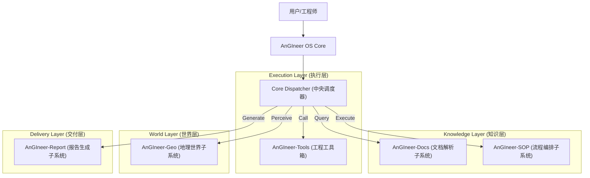

# 🏗️ AnGIneer: 工程领域的AI工程师

**AnGIneer** (AGI + Engineer) 是专为严谨工程领域打造的AI操作Agent系统。它将小型语言模型 (SLM)、标准作业程序 (SOPs)、工程工具链 (EngTools) 与地理信息世界 (GeoWorld) 深度融合，致力于为工程师提供**过程可控、结果精确、具备环境感知能力**的自动化解决方案。

> *"Human Defines SOP, AnGIneer Executes with Precision."*

---

## 1. 核心架构 (Architecture)

AnGIneer 不仅仅是一个 Agent，更是一套连接知识、工具与物理世界的工业级 OS。系统由以下五大核心子系统构成：



### 1.1 子系统矩阵 (Subsystem Matrix)

| 子系统 | 代号 | 核心职责 | 独立性 |
| :--- | :--- | :--- | :--- |
| **AnGIneer-SOP** | `Process Core` | **流程大脑**。负责 SOP 的 Markdown 定义、JSON 解析、流程可视化编辑与状态管理。 | ⭐⭐⭐ |
| **AnGIneer-Tools** | `Skill Core` | **专业工具**。提供高精度的工程计算器、查表工具、专业公式库及仿真接口。 | ⭐⭐ |
| **AnGIneer-Docs** | `Knowledge Core` | **行业记忆**。基于 RAG 的规范解析系统，支持 PDF/Word 深度解析、图表语义提取与经验库构建。 | ⭐⭐⭐⭐ |
| **AnGIneer-Geo** | `Spatial Core` | **世界底座**。集成 GIS 数据、水文气象信息，提供三维空间运算与数字孪生环境。 | ⭐⭐⭐⭐ |
| **AnGIneer-Report** | `Delivery Core` | **交付终端**。基于计算结果与三维场景，自动生成排版精美的 Word/PDF 工程报告。 | ⭐⭐⭐ |

---

## 2. 核心理念 (Philosophy)

- **确定性优先 (Deterministic First)**: 在工程领域，"准确"优于"创造"。AnGIneer 通过严格遵循 SOP，杜绝 LLM 的幻觉风险。
- **混合智能 (Hybrid Intelligence)**: **Code** 负责严谨逻辑与计算，**LLM** 负责意图理解、非结构化数据解析与人机交互。
- **环境感知 (Context Aware)**: 打通数字世界与物理世界（GeoWorld），让计算不再是真空中的数学题，而是基于真实地理环境的工程决策。

---

## 3. 开发路线图 (Roadmap)

### 阶段一：内核构建 (OS Kernel) - v0.1
*目标：构建 AnGIneer OS 的核心调度引擎 (Dispatcher)，跑通最小闭环。*
- [✅] **多模型支持**: 集成 Qwen3-4B, Qwen2.5-7B, GLM-Flash 等主流小参数SLM。
- [✅] **混合调度器**: 实现 `Dispatcher.py`，支持 Tool/LLM 动态切换。
- [✅] **执行可视化**: 生成 `Result.md`，实时透视决策链路。
- [ ] **SOP 标准化**: 定义 AnGIneer-SOP 的 Markdown/JSON 协议规范。

### 阶段二：知识与视觉 (Docs & Vision) - v0.2
*目标：启动 `AnGIneer-Docs` 子系统，解决"数据源"问题。*
- [ ] **深度文档解析**: 开发 PDF 解析器，精准提取规范条文与表格。
- [ ] **图表语义化**: 让 AI "读懂" 工程图表（曲线图、设计图）。
- [ ] **经验库构建**: 建立基于向量检索的历史案例库。

### 阶段三：交互与编排 (Interaction) - v0.3
*目标：启动 `AnGIneer-SOP` 前端，提供可视化的作业环境。*
- [ ] **Web 控制台**: 基于 Vue3 + Antd 的任务管理界面。
- [ ] **流程编辑器**: 拖拽式 SOP 设计器，降低规则制定门槛。
- [ ] **人机协作 (HITL)**: 支持暂停、断点调试与人工参数修正。

### 阶段四：世界模型 (Geo World) - v0.4
*目标：启动 `AnGIneer-Geo` 子系统，接入三维地理数据。*
- [ ] **GeoWorld 引擎**: 集成 GIS/BIM 数据，构建数字孪生底座。
- [ ] **环境 API**: 提供 `get_terrain()`, `get_hydrology()` 等标准接口。
- [ ] **空间计算**: 实现断面分析、土方计算等三维算法。

### 阶段五：闭环交付 (Delivery) - v0.5+
*目标：启动 `AnGIneer-Report` 子系统，实现全自动交付。*
- [ ] **智能报告**: 自动生成含计算书、图纸、三维截图的完整报告。
- [ ] **行业扩展**: 从航道工程扩展至水利、交通、土木等领域。

---

## 4. 快速开始 (Quick Start)

1.  **环境配置**:
    ```bash
    git clone https://github.com/YourOrg/AnGIneer.git
    cd AnGIneer
    pip install -r requirements.txt
    ```
2.  **配置密钥**: 在 `.env` 中设置 `LLM_API_KEY`。
3.  **运行示例**:
    ```python
    from backend.src.core.sop_loader import SopLoader
    from backend.src.agents.dispatcher import Dispatcher

    # 加载 SOP
    loader = SopLoader("backend/sops")
    sops = loader.load_all()

    # 执行任务
    dispatcher = Dispatcher()
    result = dispatcher.run(sops[0], {"user_query": "计算设计船型参数"})
    ```

---
*AnGIneer - Re-engineering the Future of Engineering.*
