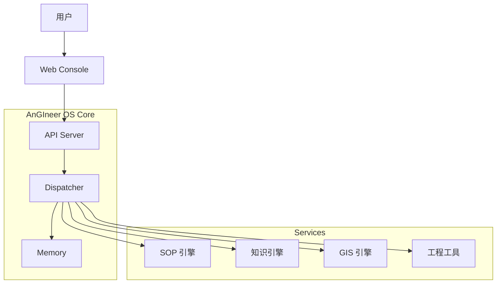
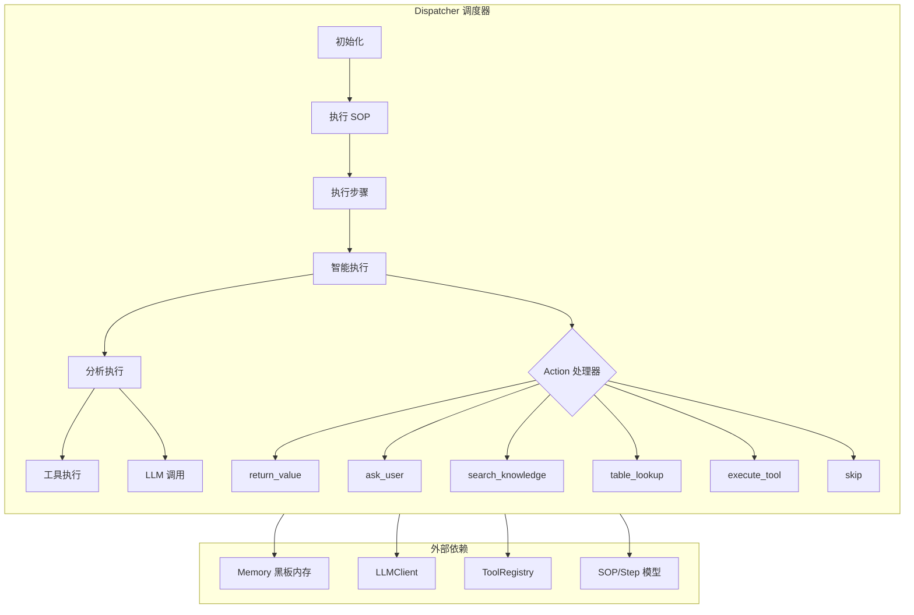
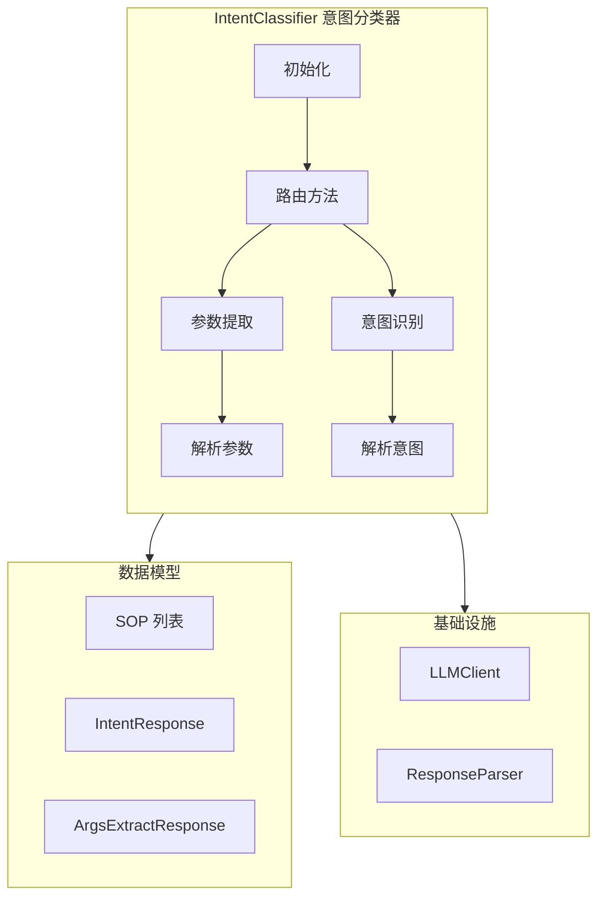
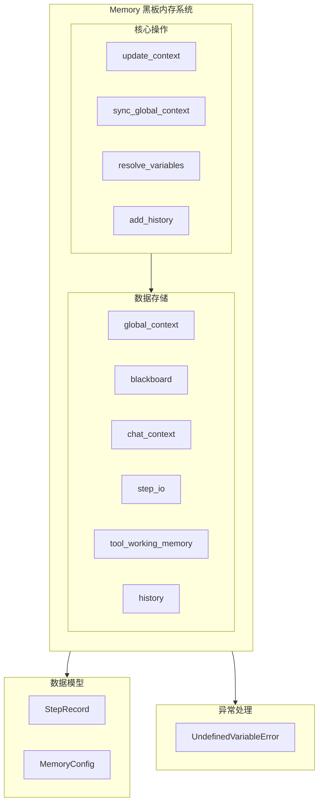
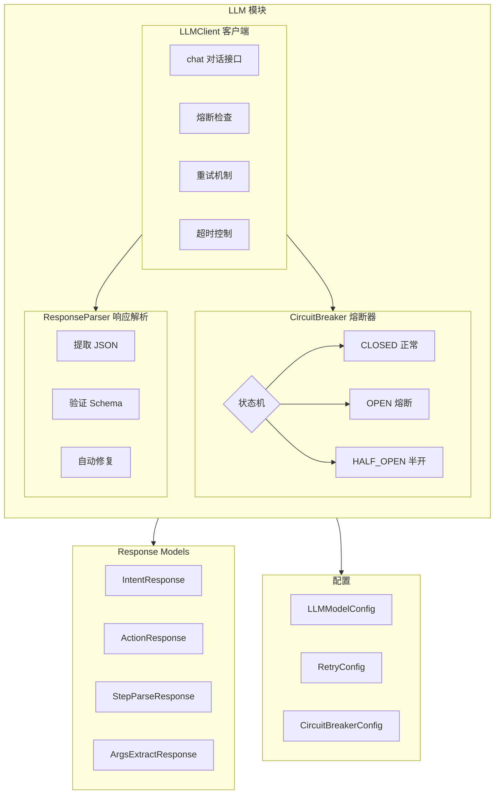
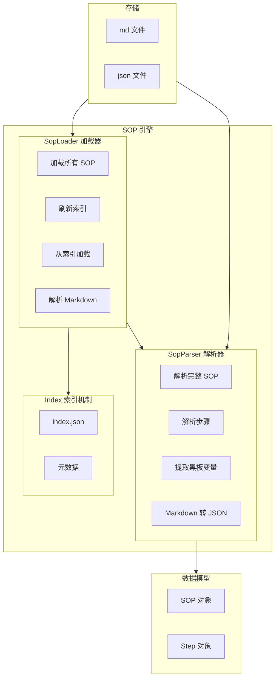

# 🏗️ AnGIneer: 工程领域的AI工程师

**AnGIneer** (AGI + Engineer) 是专为严谨工程领域打造的AI操作Agent系统。它将小型语言模型 (SLM)、标准作业程序 (SOPs)、工程工具链 (EngTools) 与地理信息世界 (GeoWorld) 深度融合，致力于为工程师提供**过程可控、结果精确、具备环境感知能力**的自动化解决方案。

> *"Human Defines SOP, AnGIneer Executes with Precision."*

---

## 1. 核心理念 (Philosophy)

- **确定性优先 (Deterministic First)**: 在工程领域，"准确"优于"创造"。AnGIneer 通过严格遵循 SOP，杜绝 LLM 的幻觉风险。
- **混合智能 (Hybrid Intelligence)**: **Code** 负责严谨逻辑与计算，**LLM** 负责意图理解、非结构化数据解析与人机交互。
- **环境感知 (Context Aware)**: 打通数字世界与物理世界（GeoWorld），让计算不再是真空中的数学题，而是基于真实地理环境的工程决策。

---

## 2. 核心架构 (Architecture)

AnGIneer 不仅仅是一个 Agent，更是一套连接知识、工具与物理世界的工业级 OS。系统采用 **Monorepo (单体仓库)** 架构，由以下核心模块构成：



### 2.1 子系统矩阵 (Subsystem Matrix)

| 子系统 | 对应服务 | 核心职责 | 独立性 |
| :--- | :--- | :--- | :--- |
| **AnGIneer-SOP** | `services/sop-core` + `packages/sop-ui` | **流程大脑**。负责 SOP 的定义、解析与可视化编排。 | ⭐⭐⭐ |
| **AnGIneer-Tools** | `services/engtools` + `packages/engtools-ui` | **专业工具**。高精度工程计算器、脚本库与交互界面。 | ⭐⭐ |
| **AnGIneer-Docs** | `services/docs-core` + `packages/docs-ui` | **行业记忆**。基于AnGIneer数据标准的规范自动解析与知识库管理。 | ⭐⭐⭐⭐ |
| **AnGIneer-Geo** | `services/geo-core` + `packages/geo-ui` | **世界底座**。集成 GIS 数据、水文气象信息与地图展示。 | ⭐⭐⭐⭐ |
| **AnGIneer-Report** | (Planned) | **交付终端**。自动生成工程报告。 | ⭐⭐⭐ |

### 2.2 核心模块架构 (dispatcher.py)

**调度器 (Dispatcher)** 是 AnGIneer OS 的执行引擎，负责 SOP 步骤的编排、工具调用与上下文更新。



**核心方法说明：**
| 方法 | 职责 | 依赖 |
|:---|:---|:---|
| `run(sop)` | SOP 执行主入口，遍历所有步骤 | Memory, SOP |
| `_execute_step(step)` | 根据步骤类型选择执行策略 | Step, Memory |
| `_smart_step_execution` | 智能步骤执行，使用策略模式处理不同 action | LLMClient |
| `_execute_tool_safe` | 安全执行工具，带错误处理 | ToolRegistry |
| `_extract_json_from_response` | 从 LLM 响应中提取 JSON | - |

---

### 2.3 核心模块架构 (classifier.py)

**意图分类器 (IntentClassifier)** 负责分析用户查询，匹配最合适的 SOP 并提取参数。



**核心方法说明：**
| 方法 | 职责 | 输入/输出 |
|:---|:---|:---|
| `route(query)` | 主路由入口 | query → (SOP, args, reason) |
| `_extract_args_with_blackboard` | 从查询中提取参数 | query, keys → args{} |

---

### 2.4 核心模块架构 (memory.py)

**记忆系统 (Memory)** 实现黑板模式，负责全局上下文、执行历史和临时工作记忆管理。



**核心功能说明：**
| 功能 | 描述 | 典型使用场景 |
|:---|:---|:---|
| `blackboard` | 步骤间数据共享的核心存储 | 步骤 A 输出 → 步骤 B 输入 |
| `resolve_variables()` | 解析 `${variable}` 语法 | 步骤输入参数动态替换 |
| `history` | 执行历史追踪 | 审计、回滚、调试 |
| `tool_working_memory` | 工具临时数据 | 复杂工具的中间状态 |

---

### 2.5 核心模块架构 (llm.py & response_models.py)

**LLM 客户端** 提供统一的大模型调用接口，支持多模型配置、熔断器、重试机制。



**稳定性机制说明：**
| 机制 | 作用 | 配置项 |
|:---|:---|:---|
| 熔断器 (CircuitBreaker) | 防止级联故障 | failure_threshold, recovery_timeout |
| 重试 (Retry) | 自动恢复临时故障 | max_attempts, backoff_factor |
| 超时 (Timeout) | 避免长时间等待 | connect_timeout, read_timeout |

---

### 2.6 核心模块架构 (sop_loader.py & sop_parser.py)

**SOP 引擎** 负责标准作业程序的加载、解析与管理。



**索引机制优势：**
| 特性 | 说明 | 收益 |
|:---|:---|:---|
| 懒加载 | 仅加载元数据，不加载完整内容 | 启动速度快 |
| 轻量级路由 | Router 只获取 SOP 描述 | 减少 Context Window 占用 |
| 按需解析 | 执行时才解析完整 SOP | 内存效率高 |

---

## 3. 开发路线图 (Roadmap)

### 阶段一：内核构建 (Core) - v0.1
*目标：构建 AnGIneer OS 的核心调度引擎 (Dispatcher)、意图识别（Classifier）、SOP解析引擎 (SOP-Parser)、数据标准（contextStruct）和记忆总线（Blackboard)，跑通最小闭环。*
- [✅] **混合调度器**: 实现 `Dispatcher`，支持 Tool/LLM 动态切换。
- [✅] **多模型支持**: 支持任意LLM模型，目前已配置Qwen\Deepseek等，可无限扩展，并定义其与SOP、EngTools的交互协议`response_models.py`。
- [✅] **SOP标准协议**: 定义AnGIneer-SOP的Markdown/JSON协议规范。
- [✅] **数据标准**: 定义核心业务数据结构 (`Step`, `SOP`, `AgentResponse`) 与 LLM 响应结构 (`IntentResponse`, `ActionResponse`, `StepParseResponse`, `ArgsExtractResponse`)。
- [✅] **黑板报机制**: 在`memory`实现Blackboard总线机制。
- [✅] **核心模块测试**: 完成5个注册考试题的测试。
- [✅] **执行可视化（Lite）**: 注册考试题部分，可生成`Result.md`，实时透视决策链路。

### 阶段二：知识与视觉 (Docs & Vision) - v0.2
*目标：启动 `AnGIneer-Docs` 子系统，解决"数据源"问题。*
- [ ] **深度文档解析**: 开发 PDF 解析器，精准提取规范条文与表格。
- [ ] **图表语义化**: 让 AI "读懂" 工程图表（曲线图、设计图）。
- [ ] **经验库构建**: 建立基于向量检索的历史案例库。

### 阶段三：交互与编排 (Interaction) - v0.3
*目标：启动 `AnGIneer-SOP` 前端，提供可视化的作业环境。*
- [ ] **Web 控制台**: 基于 Vue3 + Antd 的任务管理界面。
- [ ] **流程编辑器**: 拖拽式 SOP 设计器，降低规则制定门槛。
- [ ] **人机协作 (HITL)**: 支持暂停、断点调试与人工参数修正。

---

## 4. 快速开始 (Quick Start)
### 4.1 项目结构 (Project Structure)

本项目采用模块化单体仓库结构，便于独立维护与发布：

```text
AnGIneer/
├── apps/                   # 🚀 应用入口
│   ├── web-console/        # [前端] 主控台 (Vue3 + Ant Design Vue)
│   └── api-server/         # [后端] 主 API 网关 (FastAPI)
│
├── packages/               # 📦 前端组件包 (Vue 组件库，可独立发布到 npm)
│   ├── docs-ui/            # [知识引擎] 文档管理与解析可视化
│   ├── sop-ui/             # [SOP引擎] 流程编排与执行可视化
│   ├── geo-ui/             # [空间引擎] GIS 地图与图层管理
│   ├── engtools-ui/        # [专业工具] 工程计算器与工具界面
│   └── ui-kit/             # [基础组件] 共享 UI 组件库
│
├── services/               # 🧠 后端核心服务 (Python 包，可独立发布到 PyPI)
│   ├── angineer-core/      # [OS内核] 调度器、内存管理、基础架构【⚠当前v0.1的重点】
│   ├── sop-core/           # [SOP引擎] 流程解析器、验证器
│   ├── docs-core/          # [知识引擎] 文档解析、RAG 检索
│   ├── geo-core/           # [空间引擎] GIS 接口封装
│   └── engtools/           # [专业工具] 独立工程算法与脚本库
│
└── data/                   # 💾 数据存储
    ├── sops/               # SOP 流程定义文件
    ├── knowledge_base/     # 规范文档库
    └── geo_data/           # 地理空间数据
```

### 4.2 环境准备

```bash
git clone https://github.com/YourOrg/AnGIneer.git
cd AnGIneer

# 安装核心包 (开发模式)
pip install -e services/angineer-core/src
pip install -e services/sop-core/src
pip install -e services/docs-core/src
pip install -e services/geo-core/src
pip install -e services/engtools/src

# 安装 API Server 依赖
pip install -r apps/api-server/requirements.txt (如果存在)
```

### 4.3 运行测试

项目使用 pytest 进行测试，测试分为单元测试和集成测试两类：

```bash
# 运行所有测试
python -m pytest tests/unit/ tests/integration/ -v

# 只运行单元测试 (107 个测试)
python -m pytest tests/unit/ -v

# 只运行集成测试 (14 个测试)
python -m pytest tests/integration/ -v

# 运行特定测试文件
python -m pytest tests/unit/test_unit_dispatcher.py -v
python -m pytest tests/integration/test_03_dispatcher_verify.py -v
```

**测试结构：**
```
tests/
├── conftest.py              # pytest 配置文件
├── unit/                    # 单元测试 (107 个)
│   ├── test_unit_classifier.py
│   ├── test_unit_config.py
│   ├── test_unit_dispatcher.py
│   ├── test_unit_logger.py
│   ├── test_unit_memory.py
│   └── test_unit_response_parser.py
└── integration/             # 集成测试 (14 个)
    ├── test_00_llm_chat.py
    ├── test_01_tool_registration.py
    ├── test_02_sop_analysis.py
    ├── test_03_dispatcher_verify.py
    ├── test_04_intent_classifier.py
    └── test_05_Q1_with_reports.py
```

### 4.4 运行服务

1.  **配置密钥**: 在 `.env` 中设置 `LLM_API_KEY`。
2.  **启动 API Server**:
    ```bash
    python apps/api-server/main.py
    ```
3.  **启动 Web Console**:
    ```bash
    cd apps/web-console
    pnpm install
    pnpm run dev
    ```

---
*AnGIneer - Re-engineering the Future of Engineering.*
