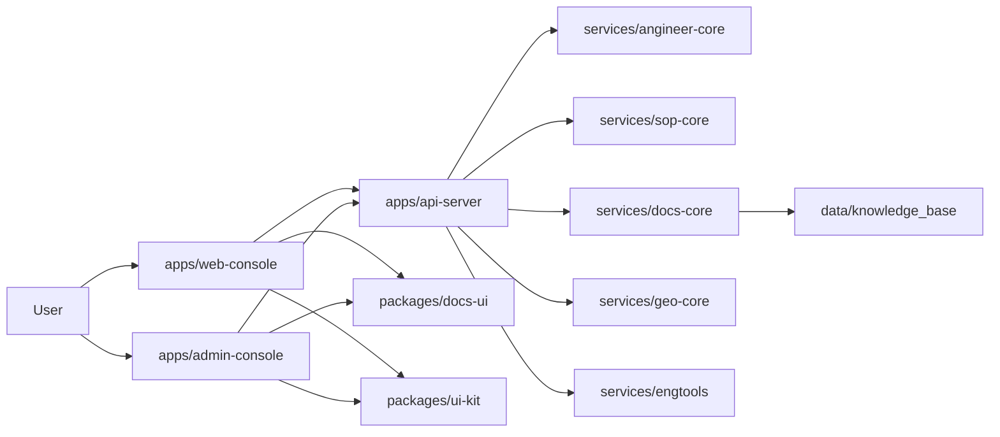
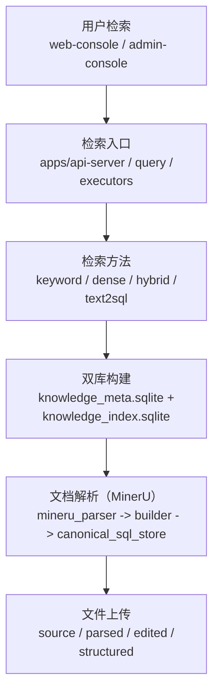

# 🏗️ AnGIneer: 工程领域的AI工程师

**AnGIneer** (AGI + Engineer) 是专为严谨工程领域打造的AI操作Agent系统。它将小型语言模型 (SLM)、标准作业程序 (SOPs)、工程工具链 (EngTools) 与地理信息世界 (GeoWorld) 深度融合，致力于为工程师提供**过程可控、结果精确、具备环境感知能力**的自动化解决方案。

> *"Human Defines SOP, AnGIneer Executes with Precision."*

---

## 1. 核心理念

- **确定性优先 (Deterministic First)**: 在工程领域，"准确"优于"创造"。AnGIneer 通过严格遵循 SOP，杜绝 LLM 的幻觉风险。
- **混合智能 (Hybrid Intelligence)**: **Code** 负责严谨逻辑与计算，**LLM** 负责意图理解、非结构化数据解析与人机交互。
- **环境感知 (Context Aware)**: 打通数字世界与物理世界（GeoWorld），让计算不再是真空中的数学题，而是基于真实地理环境的工程决策。

---

## 2. 核心架构

AnGIneer 不仅仅是一个 Agent，更是一套连接知识、工具与物理世界的工业级 OS。系统采用 **Monorepo (单体仓库)** 架构：

### 全局权威架构图（简版）

这部分作为整个仓库的总入口，优先回答三个问题：

- 用户从哪两个前端进入系统
- 前端请求经过哪一层网关进入后端
- 后端核心能力由哪些服务群承接


```mermaid
flowchart LR
  User["User"]
  Web["apps/web-console"]
  Admin["apps/admin-console"]
  Api["apps/api-server"]
  DocsUI["packages/docs-ui"]
  UIKit["packages/ui-kit"]
  Agent["services/angineer-core"]
  SOP["services/sop-core"]
  Docs["services/docs-core"]
  Geo["services/geo-core"]
  Tools["services/engtools"]
  Data["data/knowledge_base"]

  User --> Web
  User --> Admin
  Web --> DocsUI
  Admin --> DocsUI
  Web --> UIKit
  Admin --> UIKit
  Web --> Api
  Admin --> Api
  Api --> Agent
  Api --> SOP
  Api --> Docs
  Api --> Geo
  Api --> Tools
  Docs --> Data
```

### 全局不变量

- 外部交互入口固定为 `web-console`、`admin-console` 与 `api-server`
- 前端默认不直连后端核心服务，而是统一经由 `apps/api-server`
- 文档知识能力由 `docs-core` 落盘到 `data/knowledge_base`
- `web-console` 与 `admin-console` 默认共享 `docs-ui` 协议和公共组件

### 全局代码锚点

- 前端入口：`apps/web-console`、`apps/admin-console`
- 网关入口：`apps/api-server`
- 前端共享层：`packages/docs-ui`、`packages/ui-kit`
- 核心服务层：`services/angineer-core`、`services/sop-core`、`services/docs-core`、`services/geo-core`、`services/engtools`
- 运行时知识存储：`data/knowledge_base`

```
┌─────────────────────────────────────────────────────────────┐
│                         用户界面层                             │
│  ┌──────────────────────────────────────────────────────┐  │
│  │  apps/web-console/ (Vue 3 + Ant Design Vue)  端口3005 │  │
│  │  apps/admin-console/ (Vue 3 + Ant Design Vue) 端口3002│  │
│  └──────────────────────────────────────────────────────┘  │
└────────────────────────────┬────────────────────────────────┘
                             │ HTTP API
┌────────────────────────────▼────────────────────────────────┐
│                      API 网关层 (FastAPI)                     │
│                    apps/api-server/main.py  端口8789          │
└────────────────────────────┬────────────────────────────────┘
                             │
┌────────────────────────────▼────────────────────────────────┐
│                      后端核心服务层                            │
│  angineer-core | sop-core | docs-core | geo-core | engtools   │
└─────────────────────────────────────────────────────────────┘
```

### 2.1 子系统矩阵

| 子系统 | 对应服务 | 核心职责 |
|:---|:---|:---|
| **AnGIneer-SOP** | `services/sop-core` | **流程大脑**。负责 SOP 的定义、解析与可视化编排。 |
| **AnGIneer-Tools** | `services/engtools` | **专业工具**。高精度工程计算器、脚本库与交互界面。 |
| **AnGIneer-Docs** | `services/docs-core` | **行业记忆**。基于AnGIneer数据标准的规范自动解析与知识库管理。 |
| **AnGIneer-Geo** | `services/geo-core` | **世界底座**。集成 GIS 数据、水文气象信息与地图展示。 |

### 2.2 前端资源架构（当前）

```text
ResourceAdapter(project/knowledge/sop)
  -> OpenResourcePayload
  -> openResource
  -> web-console Workbench Tabs

admin-console 与 web-console 共享同一套 KnowledgeTree / KnowledgeChatPanel / SOPTree / SOPChatPanel / 资源适配协议，基础 SmartTree / BaseChat 下沉至 ui-kit
```

### 2.3 AnGIneer-Core主调度模块 
  逻辑：负责用户请求的路由、任务调度与协调。逻辑架构如下：


### 2.4 AnGIneer-Dcos知识库模块
（1）模块截图：


（2）逻辑架构

```mermaid
flowchart TB
  User["用户检索\n web-console / admin-console"]
  Query["检索入口\n apps/api-server / query / executors"]
  Retrieval["检索方法\n keyword / dense / hybrid / text2sql"]
  DualDB["双库构建\n knowledge_meta.sqlite + knowledge_index.sqlite"]
  Parse["文档解析（MinerU）\n mineru_parser -> builder -> canonical_sql_store"]
  Upload["文件上传\n source / parsed / edited / structured"]

  User --> Query
  Query --> Retrieval
  Retrieval --> DualDB
  DualDB --> Parse
  Parse --> Upload
```

（3）开发路线图
状态：`已完成` / `进行中` / `未开始` / `待评估`

| 阶段 | 子任务 | 进度 |
|:---|:---|:---|
| P0 文档收敛 | README、`apps-techniques`、`services-techniques` 对齐真实实现 | 已完成 |
| P0 文档收敛 | `docs-ui` 未接线 API / composable 盘点 | 已确认，待清理 |
| P1 检索基础 | `docs_core/indexing` 重构落地 | 已完成 |
| P1 检索基础 | DashScope embedding + hash fallback | 已完成 |
| P1 检索基础 | Chroma / SQLite vector store 切换 | 已完成 |
| P1 检索基础 | chunk / table / formula / schema 向量索引产出 | 已完成 |
| P1 检索基础 | `dense_retriever` 改为真实向量召回 | 已完成 |
| P1 检索基础 | 召回质量调优、ANN 参数、dense+sparse 融合 | 进行中 |
| P2 复合问答 | Query Decomposition | 未开始 |
| P2 复合问答 | 多路子查询规划 | 未开始 |
| P2 复合问答 | `synthesis_executor` | 未开始 |
| P2 复合问答 | 多证据拼装回答 | 未开始 |
| P3 Text-to-SQL | 单表聚合 / 过滤 / 排序 | 未开始 |
| P3 Text-to-SQL | SQL 校验与白名单增强 | 未开始 |
| P4 评测平台 | 评测结果持久化 | 未开始 |
| P4 评测平台 | 回放与 A/B 对比 | 未开始 |
| P5 策略平面 | A/B/C 多策略是否保留 | 待评估 |


### 2.5 AnGIneer-SOPs经验库模块
  暂未开发，计划v0.2完成

### 2.6 AnGIneer-GeoWorld世界模型模块
  暂未开发，计划v0.3完成

---

## 3. 快速开始

### 3.1 环境准备

```bash
git clone https://github.com/YourOrg/AnGIneer.git
cd AnGIneer
```

### 3.2 安装依赖

```bash
# 安装前端依赖
pnpm install

# 安装后端依赖
pip install -e services/angineer-core -e services/sop-core -e services/docs-core -e services/geo-core -e services/engtools
```

### 3.3 启动服务

```bash
pnpm dev
pnpm dev:frontend
pnpm dev:admin
pnpm dev:backend
```

### 3.4 运行测试

```bash
pnpm harness
pnpm harness:workflow
pnpm harness:tooling
pnpm docs:arch-check
```

---

## 4. 开发路线图

| 阶段 | 版本 | 目标 |
|:---|:---|:---|
| **内核构建** | v0.1 | 调度器、意图识别、SOP解析、记忆总线、工具引擎 |
| **知识与视觉** | v0.2 | 文档解析、PDF 高级渲染优化（防闪烁/自适应）、图表语义化、经验库构建 |
| **交互与编排** | v0.3 | Web控制台、流程编辑器、人机协作 |

---

## 5. 文档

给 AI Coding Tool 的结构化架构索引请查看 [docs/architecture-map.yaml](./docs/architecture-map.yaml)

前端架构图、可开工改造清单请查看 [docs/apps-techniques.md](./docs/apps-techniques.md)

后端架构图、数据与策略实现请查看 [docs/services-techniques.md](./docs/services-techniques.md)

---

*AnGIneer - Re-engineering the Future of Engineering.*
