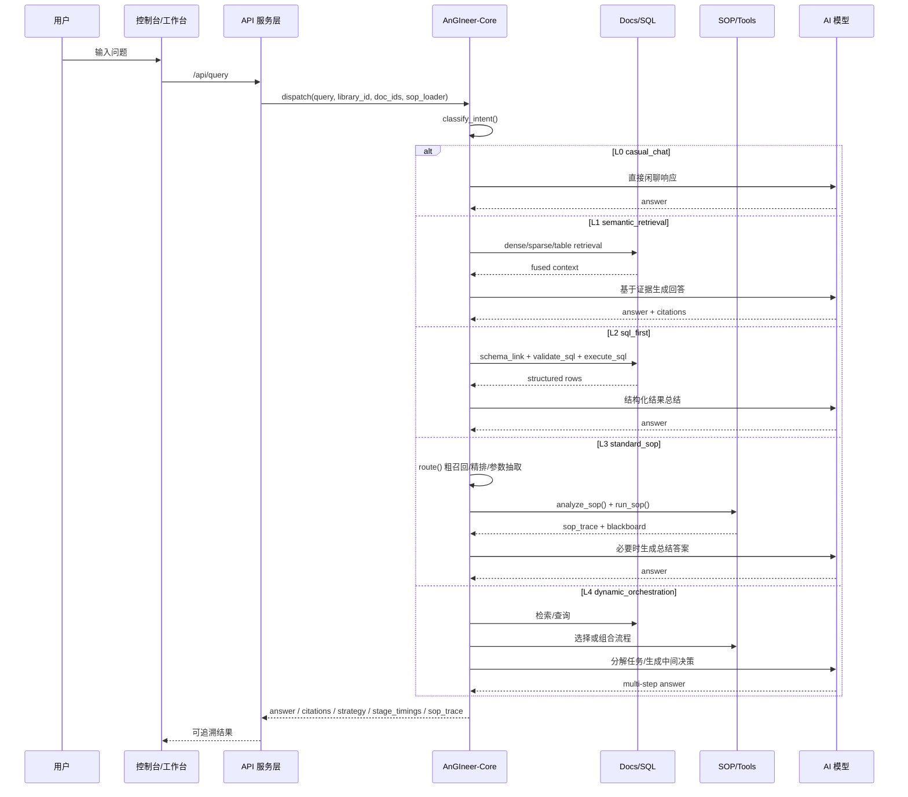
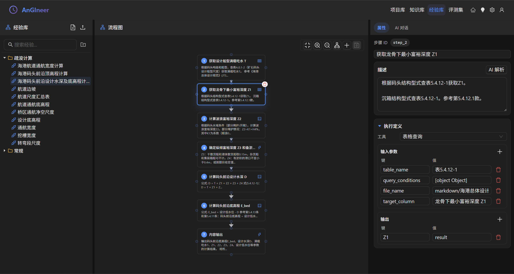
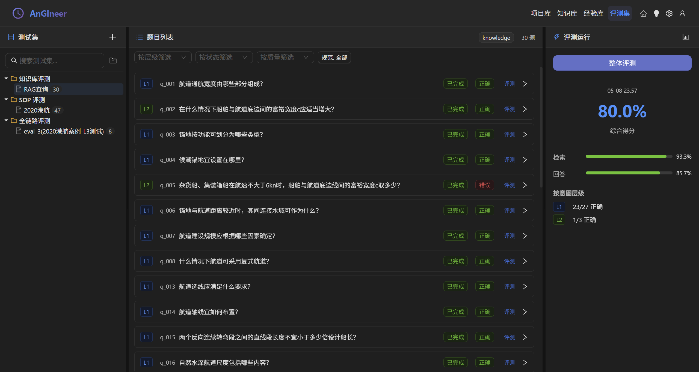
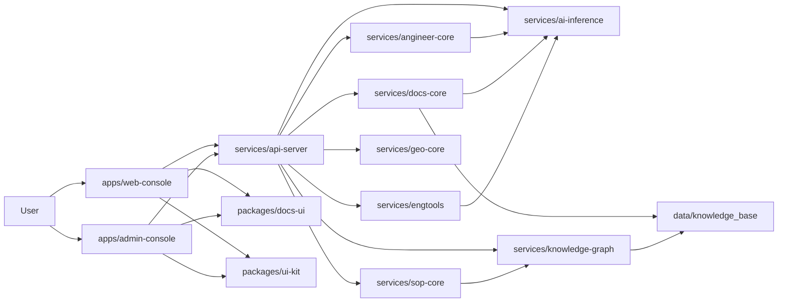

# 🏗️ AnGIneer: 工程领域的AI工程师

**AnGIneer** (AGI + Engineer) 是专为严谨工程领域打造的Agent系统。

仅使用不微调的小型语言模型 (SLM)的能力，融合结构化规范库 (Docs)、标准作业程序 (SOPs)、工程工具链 (EngTools) 与地理信息世界 (GeoWorld) ，成为工程师的最佳助手。

> <br />

***

## 1. 核心理念

*"Human Defines SOP, AnGIneer Executes with Precision."*

***

## 2. 核心架构

### 2.1 系统矩阵

| 子系统                | 核心职责      | 主要任务                   | 输入                          | 输出                          |
| :----------------- | :-------- | :--------------------- | :-------------------------- | :-------------------------- |
| **AnGIneer-Core**  | **核心大脑**  | Agent意图识别、工具调度、记忆黑板等   | 用户问题、对话上下文、历史会话              | 调度决策（L0-L4）、最终答案、执行轨迹        |
| **AnGIneer-Docs**           | **结构化规范**  | 基于MinerU的规范自动解析与知识库管理       | PDF / DOCX / 图片（规范文档）       | 结构化 JSON、Markdown、知识库索引、引用证据 |
| **AnGIneer-KnowledgeGraph** | **知识图谱**   | 基于文档A，LLM提取实体关系动态生成图谱B + cangjie-skill提取器附加语义标注 | 结构化文档 A（来自 Docs）            | 知识图谱 B（实体/关系/路径）            |
| **AnGIneer-SOP**            | **经验流程**   | 基于图谱B自动生成SOP + SOP CRUD + 运行时契约 | 知识图谱 B（实体路径）、用户手动修改         | SOP JSON、运行时执行结果、黑板变量       |
| **AnGIneer-Evals** | **评测引擎**  | 测试集                    | 题集（问/答/期望）、被测模块调用结果         | 评分报告、对比看板、误差分析              |
| **AnGIneer-Tools** | **专业工具**  | 工程计算器、脚本库等             | 工程参数（数值/表格）                 | 计算结果、中间过程、单位/校验结论           |
| **AnGIneer-Geo**   | **世界底座**  | 集成GIS、水文气象等，供AI使用。     | 地理位置、查询条件（行政区/坐标/流域）        | GIS 数据、水文气象数据、底图要素          |
| **AnGIneer-AI**    | **AI 模型** | LLM 客户端 + 本地 Embedding/Reranker 模型服务 | prompt、对话历史、文档片段            | LLM 文本回复、嵌入向量、重排得分          |

***

### 2.2 AnGIneer-Core主调度模块

#### (1) 定位

```
AnGIneer的大脑，负责与用户交互并调度自身资源以完成任务。
```

#### (2) 主要功能

1. **Agent 主调度** — 以 `L0~L4` 分级策略为总开关，统一决定问题应走闲聊、语义检索、SQL、SOP 还是复杂编排链路
2. **双引擎意图分类** — 规则快速匹配（关键词+正则，毫秒级响应）+ LLM 语义理解，失败自动降级为 `L1` 语义检索
3. **SOP 路由与执行** — 先做 SOP 粗召回，再做 LLM 精排与参数抽取，命中后进入黑板式步骤执行
4. **工具调度与运行时** — 统一工具契约与注册表，支持按场景组织能力（Docs/SOP/Evals/EngTools/Geo）并可组合调用
5. **上下文构建与记忆管理** — 从知识库、SOP、历史对话等来源抽取上下文，维护对话状态与 blackboard 数据
6. **运行时治理** — 错误分级、兜底回退、日志、阶段耗时、步骤追踪与可观测性基础设施

#### (3) L0-L4 分级策略

| 层级 | 问题类型 | 典型特征 | service_mode | 主处理链路 |
| :--- | :--- | :--- | :--- | :--- |
| **L0** | 闲聊寒暄 | 问候、自我介绍、情绪表达，与工程规范无关 | `casual_chat` | 直接走 LLM 对话，不检索、不查库 |
| **L1** | 概念解析/定位问答 | “什么是…”、“在哪里…”、“如何定义…” | `semantic_retrieval` | Docs 多路召回 → Hybrid 融合 → LLM 基于证据作答 |
| **L2** | 条款应用/规范查询 | 规范编号、条款号、条件取值、查表类问题 | `sql_first` | Text2SQL / 结构化 SQL → 失败再回退语义检索 |
| **L3** | 标准工程计算 | 含明确参数、存在预定义 SOP 的标准计算题 | `standard_sop` | SOP 粗召回 → LLM 精排 → 参数抽取 → SOP 执行 |
| **L4** | 复杂复合任务 | 综合分析、方案比选、无单一 SOP 可承接 | `dynamic_orchestration` | 由 Core 动态组合 Docs/SOP/Tools/LLM 多能力链路 |

一句话：Core 不是“直接回答问题”，而是先判定问题层级，再选择最稳的执行链路。

#### (4) 主调度时序


```mermaid
sequenceDiagram
    participant User as 用户
    participant UI as 控制台/工作台
    participant API as API 服务层
    participant Core as AnGIneer-Core
    participant Docs as Docs/SQL
    participant SOP as SOP/Tools
    participant LLM as AI 模型

    User->>UI: 输入问题
    UI->>API: /api/query
    API->>Core: dispatch(query, library_id, doc_ids, sop_loader)
    Core->>Core: classify_intent()

    alt L0 casual_chat
        Core->>LLM: 直接闲聊响应
        LLM-->>Core: answer
    else L1 semantic_retrieval
        Core->>Docs: dense/sparse/table retrieval
        Docs-->>Core: fused context
        Core->>LLM: 基于证据生成回答
        LLM-->>Core: answer + citations
    else L2 sql_first
        Core->>Docs: schema_link + validate_sql + execute_sql
        Docs-->>Core: structured rows
        Core->>LLM: 结构化结果总结
        LLM-->>Core: answer
    else L3 standard_sop
        Core->>Core: route() 粗召回/精排/参数抽取
        Core->>SOP: analyze_sop() + run_sop()
        SOP-->>Core: sop_trace + blackboard
        Core->>LLM: 必要时生成总结答案
        LLM-->>Core: answer
    else L4 dynamic_orchestration
        Core->>Docs: 检索/查询
        Core->>SOP: 选择或组合流程
        Core->>LLM: 分解任务/生成中间决策
        LLM-->>Core: multi-step answer
    end

    Core-->>API: answer / citations / strategy / stage_timings / sop_trace
    API-->>UI: 可追溯结果
```

一句话：Core 把“用户目标”翻译成可执行流程，并按需编排 Docs/SOP/Evals/Tools 等能力，最终输出可追溯结果。

***

### 2.3 AnGIneer-Dcos知识库模块


#### (1) 定位

```
规范结构化，尤其是图、表、公式三大样。
```

#### (2) 主要功能

1. **规范解析** — 基于 MinerU 云服务的 PDF 解析，保留版式、标题层级、图表与公式信息
2. **表格结构化** — 基于规则对表格做分类（数值型/文本型/混合型/映射型），支持行键检索
3. **块级溯源引用** — 从回答中回溯到条文/表格/图片等证据块，满足工程审阅要求
4. **结构化入库** — 将解析结果组织为可检索的 blocks/sections，并持久化到数据库与资产存储
5. **9+来源融合检索** — 稠密/稀疏/表格/目录等多来源候选融合，动态权重分配，任务类型自适应，概率去重合并
6. **领域 Text-to-SQL** — 内置 80+ 工程关键词（工程对象/工况条件/验算目标），支持 YAML 配置动态加载，SQL 安全白名单校验
7. **查询协议** — 为上层提供统一的查询接口与返回结构（答案 + 引用 + 调试信息）
8. **知识库管理** — 文档节点、解析任务、状态流转、可视化预览（前端）

#### (3) 逻辑架构

```text
┌──────────────┐   ┌──────────────┐   ┌──────────────┐   ┌──────────────┐
│  规范文档输入  │ → │  高保真解析   │ → │  结构化增强   │ → │  索引/入库    │
│ PDF/图片/MD   │   │ (版式/图表/公式)│  │ (图-表-公式语义)│  │ (可检索可引用) │
└──────────────┘   └──────────────┘   └──────────────┘   └──────────────┘
                                                              │
                                                              ▼
                                                      ┌──────────────┐
                                                      │  统一查询入口  │
                                                      └──────────────┘
                                                              │
                                                              ▼
                                                      ┌──────────────┐
                                                      │  答案 + 证据引用 │
                                                      └──────────────┘
```

一句话：Docs 把规范"解析成结构化知识"，让查询结果自带证据引用，适合工程审阅与复核。

***

### 2.4 AnGIneer-KnowledgeGraph知识图谱模块

#### (1) 定位

```
基于文档A，LLM 顺藤摸瓜动态生成知识图谱B。
```

#### (2) 主要功能

1. **种子共现兜底** — 70 个工程标准术语的文本扫描，秒级完成基础实体关系
2. **LLM 实体+关系抽取** — 每 packet 一次调用，发现文档专属实体与关系
3. **三重验证（V1 跨域/V2 预测力/V3 独特性）** — 关系置信度后处理，通过 3/3 升级为 QUESTION_VALIDATED
4. **Zettelkasten 跨段语义连接** — 整篇文档一次调用，发现跨章节隐含关系
5. **cangjie-skill E1-E5 提取器** — 为图谱附加原则/案例/反例/术语/框架标注
6. **按文档强隔离** — library_id + doc_id 维度隔离与过滤，实体跨文档共享、关系归属文档

一句话：KnowledgeGraph 把"文档A"变成"图谱B + 语义标注"，为 SOP 生成与复杂推理提供结构化基础。

***

### 2.5 AnGIneer-SOPs经验库模块



#### (1) 定位

```
基于知识图谱B，通过 cangjie-skill 提取器产出的语义标注自动生成 SOP list，
并提供 SOP 的 CRUD 与运行时执行支持。
```

#### (2) 主要功能

1. **基于图谱的 SOP 自动生成** — 从文档图谱中识别 framework 路径或 ACTION 实体链，自动生成包含原则/案例/反例/术语标注的 SOP JSON
2. **LLM 驱动的 SOP 解析引擎** — Markdown SOP 自动转 JSON 结构化执行计划，支持 5 种工具类型识别（calculator/knowledge_search/table_lookup/user_input/conditional）
3. **黑板变量依赖提取** — 自动分析步骤间 `${variable}` 引用关系，构建 required/outputs 依赖图，失败自动降级到规则提取
4. **智能条件分支工具** — 支持精确匹配、排除法匹配、LLM 语义匹配三级降级，可嵌套查表/计算，自动识别"其他"等兜底关键词
5. **SOP 结构化** — 将"经验"沉淀为 JSON 格式的可复用流程资产
6. **步骤级引用与结构化** — 步骤描述支持结构化内容与引用，便于与规范证据联动与审阅
7. **SOP 分层管理** — SOP 与文件夹树结构管理、排序、检索
8. **SOP CRUD** — 创建/编辑/删除 SOP，支持 steps 与 blackboard 等运行字段
9. **与 Core 联动** — 作为调度输入的一部分，为复杂任务提供"可执行的经验流程"

#### (3) 逻辑架构

```text
┌──────────────┐   ┌──────────────┐   ┌──────────────┐   ┌──────────────┐
│  经验沉淀/维护  │ → │  SOP 结构化   │ → │  运行时加载   │ → │  被 Core 调度  │
│ (人/组织资产)   │   │ (步骤/引用/字段)│  │ (随用随取)    │  │ (按需执行/参考) │
└──────────────┘   └──────────────┘   └──────────────┘   └──────────────┘
```

一句话：SOP 把"老师傅经验"做成可复用流程资产，能被 Core 在复杂任务中直接引用或按步骤执行。

***

### 2.5 AnGIneer-Evals测试集模块



#### (1) 定位

```
基准测试中心，含RAG测试、注册考题测试等。
```

#### (2) 主要功能

1. **同构评测架构** — 评测器通过 Core 调度入口直接调用检索/回答链路（不走 HTTP，不依赖 asyncio），确保"离线评测与线上效果一致"
2. **多维度评测指标** — 检索评测（Hit@3/Hit@5/MRR）、Text-to-SQL 评测（执行成功率/SQL 精确匹配）、SOP 执行评测
3. **可扩展评测套件** — 检索、回答、Text2SQL、SOP 等评测器可插拔组合，支持分阶段记录与对比
4. **题集管理** — 题集创建/导入/导出/删除/重命名
5. **题目管理** — 单题增删改查、排序、标签与难度等元数据维护
6. **评测运行** — 异步启动评测、轮询进度、保存运行记录与明细
7. **结果对比** — 支持两次运行的分数差异与题目级变化对比
8. **数据落库** — 运行记录与题目存储（SQLite），便于回放与追踪

#### (3) 逻辑架构

```text
┌──────────────┐   ┌──────────────┐   ┌──────────────┐   ┌──────────────┐
│  题集/题目库   │ → │  发起评测运行  │ → │  评测器执行   │ → │  结果汇总/存档 │
│ (RAG/考题等)   │   │ (异步/可追踪)  │   │ (检索/回答/…) │  │ (可回放/对比)  │
└──────────────┘   └──────────────┘   └──────────────┘   └──────────────┘
                                                              │
                                                              ▼
                                                      ┌──────────────┐
                                                      │  对比/看板展示  │
                                                      └──────────────┘
```

一句话：Evals 用标准题集把能力"跑一遍并留证据"，用对比与看板把改动的收益/回退一眼看清。

***

### 2.7 AnGIneer-GeoWorld世界模型模块

暂未开发，计划v0.2完成

#### (1) 定位

```
工程"世界底座"：承载 GIS、水文气象、地形与工程对象等可计算信息，为检索/推理/工具调用提供统一空间语义。
```

#### (2) 主要功能

1. **面向工程的空间语义与可计算** — 不仅展示地理信息，更强调"可作为推理输入/工具参数/约束条件"的结构化世界模型
2. **基础 GIS 能力接入** — 图层加载、空间查询、坐标/投影处理、常用工程指标计算
3. **与工具链联动** — 将空间结果以工具输出形式喂给 Core 调度与下游推理

#### (3) 逻辑架构
```text
┌──────────────┐   ┌──────────────┐   ┌──────────────┐   ┌──────────────┐
│  空间数据源    │ → │  世界模型封装  │ → │  空间计算/查询 │ → │  可视化/联动  │
│ GIS/气象等    │   │ (统一语义)    │   │ (指标/约束/取数)│  │ (给Core/Tools)│
└──────────────┘   └──────────────┘   └──────────────┘   └──────────────┘
```

一句话：GeoWorld 让"地理世界"变成可计算输入，未来会和工具链与推理能力深度联动（v0.2 规划）。

***

### 2.7 技术架构图

```
┌─────────────────────────────────────────────────────────────┐
│                         用户界面层                           │
│  ┌──────────────────────────────────────────────────────┐  │
│  │  apps/web-console/ (Vue 3 + Ant Design Vue)  端口3005 │  │
│  │  apps/admin-console/ (Vue 3 + Ant Design Vue) 端口3002│  │
│  └──────────────────────────────────────────────────────┘  │
└────────────────────────────┬────────────────────────────────┘
                             │ HTTP API
┌────────────────────────────▼────────────────────────────────┐
│                      API 服务层 (FastAPI)                    │
│                 services/api-server/main.py  端口8789        │
└────────────────────────────┬────────────────────────────────┘
                             │
┌────────────────────────────▼────────────────────────────────┐
│                    AI 推理层 (ai-inference)                  │
│         LLM 客户端 │ 语义嵌入 │ 语义重排 │ 响应解析            │
└────────────────────────────┬────────────────────────────────┘
                             │
┌────────────────────────────▼────────────────────────────────┐
│                      后端核心服务层                           │
│                      angineer-core                          │
│ sop-core | knowledge-graph | docs-core | evals-core | geo-core | engtools │
└─────────────────────────────────────────────────────────────┘
```

- 前端入口：`apps/web-console`、`apps/admin-console`
- API 服务入口：`services/api-server`
- 前端共享层：`packages/docs-ui`、`packages/ui-kit`
  - **智能树组件体系**：SmartTree 通用组件 + 领域语义封装（SOPTree/KnowledgeTree/EvalDatasetTree）
  - **AIChat 对话组件**：通用 AI 对话交互组件
- AI 推理层：`services/ai-inference`（LLM 客户端、语义嵌入、语义重排）
- 核心服务层：`services/angineer-core`、`services/sop-core`、`services/knowledge-graph`、`services/docs-core`、`services/evals-core`、`services/geo-core`、`services/engtools`
- 运行时知识存储：`data/knowledge_base`


```mermaid
flowchart LR
  User["User"]
  Web["apps/web-console"]
  Admin["apps/admin-console"]
  Api["services/api-server"]
  DocsUI["packages/docs-ui"]
  UIKit["packages/ui-kit"]
  AI["services/ai-inference"]
  Agent["services/angineer-core"]
  SOP["services/sop-core"]
  KG["services/knowledge-graph"]
  Docs["services/docs-core"]
  Geo["services/geo-core"]
  Tools["services/engtools"]
  Data["data/knowledge_base"]

  User --> Web
  User --> Admin
  Web --> DocsUI
  Admin --> DocsUI
  Web --> UIKit
  Admin --> UIKit
  Web --> Api
  Admin --> Api
  Api --> AI
  Api --> Agent
  Api --> SOP
  Api --> KG
  Api --> Docs
  Api --> Geo
  Api --> Tools
  Agent --> AI
  SOP --> KG
  Docs --> AI
  Tools --> AI
  Docs --> Data
  KG --> Data
```

***

## 3. 开发路线图

| 阶段          | 版本   | 目标                           |
| :---------- | :--- | :--------------------------- |
| **注册考题版**   | v0.1 | 文档解析、规范入库、经验构建、意图分级、测试集、AI对话 |
| **世界模型增强版** | v0.2 | 三维模型（GIS、水文气象）、AI交互          |
| **迭代优化**    | v0.3 | 迭代优化                         |

***

## 4. 快速开始

### 4.1 环境准备

```bash
git clone https://github.com/YourOrg/AnGIneer.git
cd AnGIneer
```

### 4.2 安装依赖

```bash
# 安装前端依赖
pnpm install

# 安装后端依赖
pip install -e services/ai-inference -e services/angineer-core -e services/sop-core -e services/knowledge-graph -e services/docs-core -e services/geo-core -e services/engtools
```

### 4.3 启动服务

```bash
pnpm dev
pnpm dev:frontend
pnpm dev:admin
pnpm dev:backend
```

### 4.4 运行测试

```bash
pnpm harness
pnpm harness:workflow
pnpm harness:tooling
pnpm docs:arch-check
```

## 5. 开发约定

### 5.1 多租户预留（tenant_id 规约）

当前为单租户形态，但所有持久化层**必须预留 `tenant_id` 字段**，为未来 SaaS 化（v2.0）避免痛苦的 schema 迁移。

- **所有新建表**必须包含 `tenant_id TEXT NOT NULL DEFAULT 'default'` 字段，并建立联合索引 `(tenant_id, ...)`。
- **现有表**暂不强行迁移；如本就有 schema 变更时，顺带补上该字段。
- **查询路径**所有 list/get 接口预留 `tenant_id` 形参（默认 `'default'`），暂不启用过滤；启用时机为 v2.0 多租户改造。
- **配置项**：通过环境变量 `ALLOWED_ORIGINS`、`DEFAULT_TENANT_ID` 控制；上线时再启用 API Key 中间件按 `api_key → tenant_id` 映射。

### 5.2 CORS 配置

生产/对外部署时，必须通过环境变量显式配置允许的前端来源，禁止使用 `*`：

```
ALLOWED_ORIGINS=https://docs.your-domain.com,https://admin.your-domain.com
```

***

*AnGIneer - Re-engineering the Future of Engineering.*
