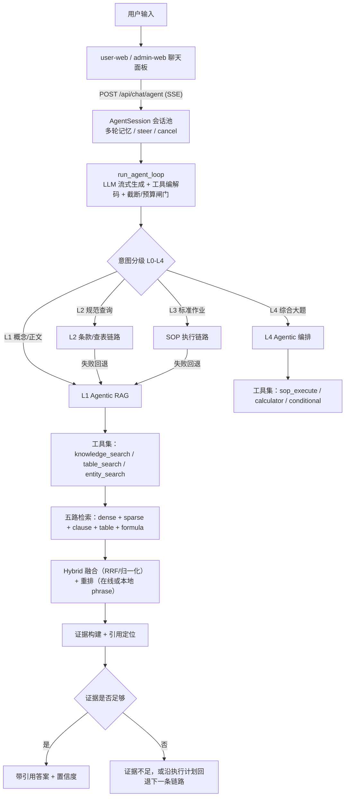
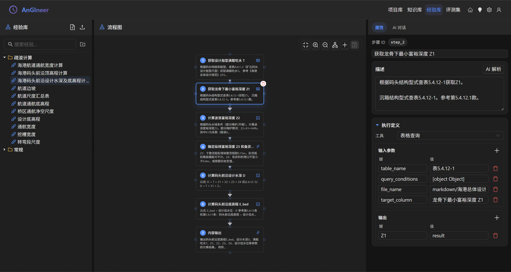
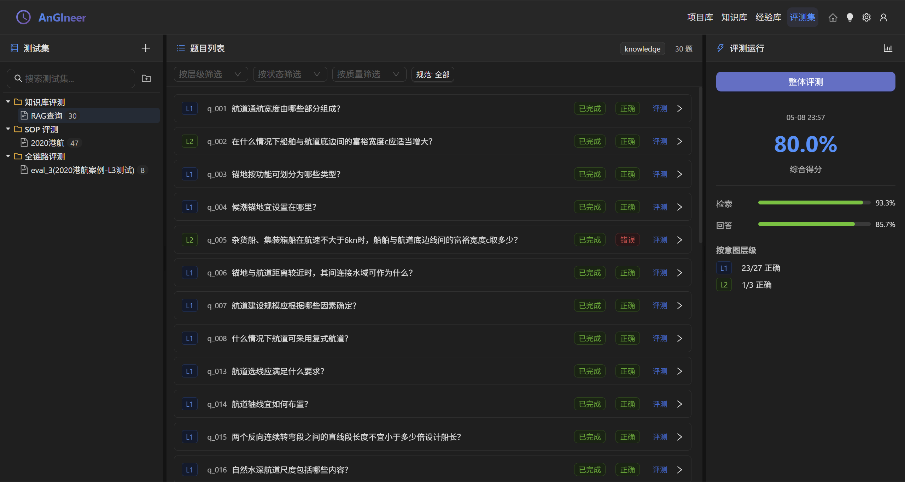

# 🏗️ AnGIneer：工程领域的 AI 工程师

**AnGIneer**（AGI + Engineer）是面向严谨工程领域的 Agent 系统：仅使用不微调的小型语言模型（SLM），融合结构化规范库（Docs）、标准作业程序（SOPs）、工程工具链（EngTools）、地理信息世界（GeoWorld）与专业软件驱动（CAD / 报告），覆盖从"规范问答"到"注册考试题解答"、"地理信息查询"、"设计报告编制"、"CAD 出图算量"的完整工程智能体链路。

> **当前代码基线：v0.2.1** —— v0.1 / v0.2 能力已落地；v0.3–v0.5 按路线推进，目标 **v0.5 正式版**，此后通过大量迭代演进到 **v1.0**。

> 核心理念：*"Human Defines SOP, AnGIneer Executes with Precision."*

***

## 1. 版本路线与现状

| 版本 | 里程碑 | 核心能力 | 代码现状 |
| :--- | :--- | :--- | :--- |
| **v0.1** | 规范问答基础版 | 文档解析入库、知识图谱、SOP 引擎、L0-L4 意图分级、AI 对话、评测框架 | ✅ 基本完成（git tag `v0.1-frontend-*`） |
| **v0.2** | Docs-SOP 问答系统化改进 | Agent 化问答链路、五路检索 + 融合重排、SOP 审核/审计、Prompt 资产化、10 阶段解析管线 + PoPo 强化、注册考试题集评测、Dream Cycle 知识巡检 | ✅ 已完成，当前迭代基线 v0.2.1 |
| **v0.3** | 世界模型 | 基于 Cesium 的三维地理世界模型，自主查询地理信息（GIS / 水文气象 / 地形），支撑更高级题目 | 🚧 骨架已存在（geo-core GIS 断面算量工具 + GIS 视图），Cesium 集成规划中 |
| **v0.4** | 设计报告 | 基于规范检索、SOP 执行轨迹与地理/计算数据，自动编制工可、初设等正式设计报告 | 🚧 规划中 |
| **v0.5** | CAD 出图算量 | 连接并驱动 CAD 引擎，自动出图、工程量计算，形成"设计 → 出图 → 算量"闭环 | 🚧 规划中，**v0.5 定位为正式版** |
| **v1.0** | 正式版迭代 | 在 v0.5 基础上大量迭代：多专业覆盖、精度与稳定性、工程化与 SaaS 化（多租户） | 🚧 目标 |

> 说明：v0.3–v0.5 描述的是路线目标；仓库当前实际代码基线为 v0.2.1，相关模块已在对应小节中标注"骨架 / 规划中"，避免与已落地能力混淆。

***

## 2. 核心架构

### 2.1 系统矩阵

| 子系统 | 核心职责 | 主要任务 | 输入 | 输出 |
| :--- | :--- | :--- | :--- | :--- |
| **AnGIneer-Core** | 核心大脑 | Agent 意图识别、工具调度、Agent 循环、记忆黑板、SOP 执行引擎 | 用户问题、对话上下文、历史会话 | 调度决策（L0-L4）、最终答案、执行轨迹 |
| **AnGIneer-Docs** | 结构化规范 + 知识图谱 + 健康巡检 | MinerU + PoPo 解析、Solo 结构化、SQLite/FTS/向量索引、五路检索、块级溯源；内含 KnowledgeGraph（`step07_graph`）与 Dream Cycle（`step08_maintain`）子模块 | PDF / DOCX / PPTX / XLSX / 图片 | 结构化 JSONL、canonical SQLite、知识图谱、引用证据、巡检报告、按文档导出的产物 |
| **AnGIneer-SOPs** | 经验流程 | 基于图谱生成 SOP、SOP CRUD + 审核/审计、运行时契约、黑板变量依赖 | 知识图谱、人工维护 | SOP JSON、运行时执行结果、审核记录 |
| **AnGIneer-Evals** | 评测引擎 | 注册考试题集、检索/回答/SOP 评测、运行对比与看板 | 题集（问/答/期望）、被测链路结果 | 评分报告、对比分析、题目级差异 |
| **AnGIneer-Tools** | 专业工具 | 工程计算器、表格查值、条件分支、知识检索、GIS 断面算量等 | 工程参数（数值/表格） | 计算结果、中间过程、校验结论 |
| **AnGIneer-Geo** | 世界底座 | GIS 工具与地理视图（当前骨架）；规划 Cesium 三维世界模型、水文气象与空间查询 | 地理位置、查询条件（行政区/坐标/流域） | GIS 数据、断面/土方计算、空间要素 |
| **AnGIneer-AI** | AI 模型 | LLM 客户端（多模型/重试/熔断/流式）+ 在线 Embedding / Reranker | prompt、对话历史、文档片段 | LLM 文本回复、嵌入向量、重排得分 |
| **AnGIneer-TreeCore** | 树操作基础设施 | 树节点 CRUD、移动、排序归一化（零外部依赖） | 树操作请求 | 规范化树数据 |

***

### 2.2 AnGIneer-Core 主调度模块

#### (1) L0-L4 分级策略

| 层级 | 问题类型 | 典型特征 | service_mode | 主处理链路 |
| :--- | :--- | :--- | :--- | :--- |
| **L0** | 闲聊寒暄 | 问候、自我介绍、情绪表达，与工程规范无关 | `casual_chat` | 直接 LLM 对话，不检索、不查库 |
| **L1** | 概念解析/定位问答 | "什么是…"、"在哪里…"、"如何定义…" | `semantic_retrieval` | Docs 多路召回 → Hybrid 融合 → LLM 基于证据作答 |
| **L2** | 条款应用/规范查询 | 规范编号、条款号、条件取值、查表类问题 | `structured_lookup` | 条款/表格结构化查证 → 失败回退语义检索 |
| **L3** | 标准工程计算 | 含明确参数、存在预定义 SOP 的标准计算题 | `standard_sop` | SOP 粗召回 → LLM 精排 → 参数抽取 → SOP 执行 |
| **L4** | 复杂复合任务 | 综合分析、方案比选、无单一 SOP 可承接 | `dynamic_orchestration` | Agent 循环动态组合 Docs/SOP/Tools/LLM 多能力链路 |

一句话：Core 不是"直接回答问题"，而是先判定问题层级，再选择最稳的执行链路，失败沿执行计划逐级回退。

#### (2) Agent 化问答链路（v0.2.1 起）

自 v0.2.1 起，问答链路以 `AgentSession + run_agent_loop` 为核心；前端统一走 `/api/chat/agent`（SSE），旧 `/api/query` 已退役，评测与内部调用统一走 `policy_query`。


```mermaid
flowchart TD
    U["用户输入"] --> F["user-web / admin-web 聊天面板"]
    F -->|"POST /api/chat/agent (SSE)"| S["AgentSession 会话池<br/>多轮记忆 / steer / cancel"]
    S --> L["run_agent_loop<br/>LLM 流式生成 + 工具编解码 + 截断/预算闸门"]
    L --> C{"意图分级 L0-L4"}
    C -->|"L1 概念/正文"| A1["L1 Agentic RAG"]
    C -->|"L2 规范查询"| A2["L2 条款/查表链路"]
    C -->|"L3 标准作业"| A3["SOP 执行链路"]
    C -->|"L4 综合大题"| A4["L4 Agentic 编排"]
    A2 -->|"失败回退"| A1
    A3 -->|"失败回退"| A1
    A4 --> T2["工具集：sop_execute / calculator / conditional"]
    A1 --> T["工具集：knowledge_search / table_search / entity_search"]
    T --> R["五路检索：dense + sparse + clause + table + formula"]
    R --> F2["Hybrid 融合（RRF/归一化）+ 重排（在线或本地 phrase）"]
    F2 --> E["证据构建 + 引用定位"]
    E --> G{"证据是否足够"}
    G -->|"是"| Ans["带引用答案 + 置信度"]
    G -->|"否"| Ref["证据不足，或沿执行计划回退下一条链路"]
```

核心环节：

1. **会话层**：`AgentSession` 按 `scene:session_id` 复用会话池，注入多轮历史，支持中途 `steer` 与 `cancel`。
2. **循环层**：`run_agent_loop` 负责 LLM 流式生成、工具调用编解码（TextToolCallCodec）、最大轮次/预算闸门与截断守卫。
3. **调度层**：意图分类（规则快速匹配 + LLM 语义理解，失败降级 L1）→ 选择 L1 语义检索 / L2 条款/查表 / L3 标准 SOP / L4 复杂编排，失败沿执行计划逐级回退；L1/L4 已 Agent 化，legacy 路径作兜底。
4. **检索层**：dense（向量，服务不可用自动降级 hash/phrase）、sparse（FTS/引用目标）、clause（条款）、table、formula 五路召回 → Hybrid 融合 → 在线 reranker 或本地 phrase 重排。
5. **作答层**：基于证据生成答案并附带引用定位（文档标题 + 章节 + PDF 跳转）；证据不足时明确拒绝或回退链路；`entity_search` 图谱无命中时自动回退正文检索。

***

### 2.3 AnGIneer-Docs 知识库模块（含 KnowledgeGraph、Dream Cycle 子模块）


#### (1) 定位

```
规范结构化，尤其是图、表、公式三大样；让规范"可读、可查、可算、可引用"。
```

#### (2) 主要功能

1. **10 阶段解析管线** — 从源文件到图谱的分阶段流水线，hard 阶段失败终止后续，soft 阶段失败仅标记自身；支持单阶段重试、任务取消、GPU 排队与阶段级可视化。
2. **MinerU 高保真解析** — 云端 PDF 解析，保留版式、标题层级、图表与公式信息；非 PDF 经 LibreOffice 自动转换。
3. **PoPo 信号增强** — MinerU-Popo 子模块提供文档树/续接表格等信号；soft 阶段，失败自动回滚并降级为 Solo 结构化，不影响主链。
4. **Solo 结构化（唯一构建者）** — 规则引擎产出块/层级/语义，PoPo 仅作信号注入；支持 LLM 标题层级复核与表格 HTML 语义。
5. **SQLite + FTS 建库** — canonical 表 + 全文索引，支撑稠密/稀疏/条款/表格/公式五路检索与块级溯源。
6. **向量索引** — 在线 Embedding API（失败自动 hash/phrase 降级），Chroma / SQLite 向量存储可选。
7. **知识图谱落库** — 结构化产物推入 `knowledge_graph.sqlite`（实体/关系/原则/案例/反例/框架）。
8. **结构化查询（text2sql 休眠）** — 引擎模块保留（schema linker / planner / validator / executor），当前未接入 agent 链路。
9. **按文档产物导出** — 按 doc_id 导出独立 `index.sqlite` / `graph.sqlite` / 结构化 JSONL，避免整库交付泄露。
10. **知识库管理** — 文档节点、解析任务、状态流转、编辑同步、可视化预览（前端）。

#### (3) 解析管线阶段

| stage_key | 阶段 | 类型 | 说明 |
| :--- | :--- | :--- | :--- |
| `source_prep` | 1 源文件准备 | hard | 复制源文件到规范目录 |
| `convert` | 2 格式转换 | hard | 非 PDF 经 LibreOffice 转 PDF；PDF 自动 skipped |
| `raw_parse` | 3.1 MinerU 解析 | hard | 调 MinerU 产出 md + images + JSON |
| `popo` | 3.2 PoPo 强化 | soft | 可选信号源，失败回滚并记 `fallback=solo` |
| `structure` | 4 结构化（Solo 唯一构建者） | hard | 产出 `doc_blocks_graph.jsonl` + meta |
| `fts` | 5 SQLite + FTS | hard | 重建 canonical 库与全文索引 |
| `vectors` | 6 向量索引 | soft | Embedding API；失败仅标本阶段 |
| `graph` | 7 知识图谱 | soft | `push_to_graph` 落图谱库 |

另有 `step08_maintain`（Dream Cycle 巡检）与 `step10_export`（按文档产物导出）作为管线外的扩展模块。

> **PoPo 子模块注意事项（更新上游时务必保留本地定制）**
>
> `services/docs-core/src/popo` 是 git submodule（MinerU-Popo，MIT 协议）。本地已将 `post_processing/model_utils.py` 中的硬编码 `url=""` / `key=""` 改为读取环境变量 `POPO_VLLM_URL` / `POPO_VLLM_API_KEY` / `POPO_MODEL_NAME`，并支持 `POPO_API_TIMEOUT`（默认 300s）与 `POPO_MAX_TOKENS`（默认 4096）。**若不保留此修改，PoPo 推理会请求打到 api.openai.com（国内 DNS 污染导致挂死）或空 url 报错。** 更新上游前先 `git -C services/docs-core/src/popo commit` 本地修改，冲突时仅针对该文件手动合并。

#### (4) KnowledgeGraph 子模块（docs-core step07_graph）

##### (1) 定位

```
基于文档 A，LLM 顺藤摸瓜动态生成知识图谱 B。
```

##### (2) 主要功能

1. **种子共现兜底** — 70 个工程标准术语文本扫描，秒级完成基础实体关系。
2. **LLM 实体 + 关系抽取** — 每 packet 一次调用，发现文档专属实体与关系。
3. **三重验证（V1 跨域 / V2 预测力 / V3 独特性）** — 关系置信度后处理，通过 3/3 升级为 QUESTION_VALIDATED。
4. **Zettelkasten 跨段语义连接** — 整篇文档一次调用，发现跨章节隐含关系。
5. **cangjie-skill E1-E5 提取器** — 为图谱附加原则/案例/反例/术语/框架标注。
6. **按文档强隔离** — `library_id + doc_id` 维度隔离与过滤，实体跨文档共享、关系归属文档。
7. **图谱人工审核** — `/api/graph/review` 提供关系验证入口。

一句话：KnowledgeGraph 把"文档 A"变成"图谱 B + 语义标注"，为 SOP 生成与复杂推理提供结构化基础。

#### (5) Dream Cycle 子模块（docs-core step08_maintain）

每日凌晨（默认 `0 2 * * *`）对知识图谱/索引库执行 5 项健康检查并生成 JSON 报告：

| # | 任务 | 实现逻辑 | 自动化边界 |
| :--- | :--- | :--- | :--- |
| 1 | 实体去重检查 | 编辑距离 + aliases 交叉检测 | ≥0.95 自动合并，0.7–0.95 人工确认 |
| 2 | 矛盾关系检测 | 同一对实体在不同文档中关系类型冲突 | 全部人工审核 |
| 3 | 孤立实体清理 | 无入边无出边 + 非种子实体 | ≥14 天自动标记 inactive，≥7 天人工确认 |
| 4 | 过期知识标记 | 文档标题年份检测（简化版） | 全部人工审核 |
| 5 | SOP 健康统计 | 读取 `data/sops/index.json` 统计 | 纯报告 |

API：`GET /api/dream-cycle/reports`、`GET /reports/{date}`、`POST /run`、去重确认/驳回、孤立实体保留/删除、`GET /health`。所有自动操作写审计日志（`data/dream_cycle/audit/`），仅标记不物理删除。

***

### 2.4 AnGIneer-SOPs 经验库模块



#### (1) 定位

```
基于知识图谱语义标注自动生成 SOP，并提供 SOP 的 CRUD、审核与运行时执行支持。
```

#### (2) 主要功能

1. **基于图谱的 SOP 自动生成** — 从文档图谱识别 framework 路径或 ACTION 实体链，自动生成含原则/案例/反例/术语标注的 SOP JSON。
2. **LLM 驱动的 SOP 解析引擎** — Markdown SOP 自动转 JSON 结构化执行计划，支持 calculator / knowledge_search / table_lookup / user_input / conditional 等工具类型。
3. **黑板变量依赖提取** — 自动分析 `${variable}` 引用关系，构建 required/outputs 依赖图，失败自动降级到规则提取。
4. **智能条件分支工具** — 精确匹配、排除法匹配、LLM 语义匹配三级降级，可嵌套查表/计算，自动识别"其他"等兜底关键词。
5. **SOP 审核与审计** — 新增 `POST /{sop_id}/review` 审核闸门与 `GET /{sop_id}/audit` 审计记录，LLM 生成的 SOP 需审核后才进入可执行库。
6. **SOP 分层管理** — SOP 与文件夹树结构管理、排序、检索、导入、删除预览。
7. **与 Core 联动** — 作为调度输入的一部分，为复杂任务提供"可执行的经验流程"。

***

### 2.5 AnGIneer-Evals 评测引擎模块



#### (1) 定位

```
基准测试中心，含 RAG 检索评测、注册考试题评测等。
```

#### (2) 主要功能

1. **同构评测架构** — 评测器通过 Core 调度入口直接调用检索/回答链路（不走 HTTP），确保"离线评测与线上效果一致"。
2. **注册考试题集** — 内置《港口与航道工程》2019 / 2020 注册考试题集（`data/evals/datasets/exam-harbor-2019-2020.json`、`reviewed-exam-2020-2019.json`），含正确答案、解析、判分关键字、必引条文与思考过程，支持按年份/专业/难度/题型筛选。
3. **多维度评测指标** — 检索评测（Hit@1/Hit@3/Hit@5/MRR/citation_hit）、SOP 执行评测、回答语义评测。
4. **检索精度分桶** — 失败分桶（`missed_exact_target`、`wrong_section_bias`、`caption_body_confusion`、`formula_symbol_confusion`），按 question_type / doc_id / failure_bucket 聚合，驱动检索迭代回归。
5. **题集与题目管理** — 题集创建/导入/导出/删除/重命名，题目增删改查、排序、标签与难度元数据。
6. **评测运行与对比** — 异步启动评测、轮询进度、运行记录；支持两次运行分数差异与题目级变化对比。
7. **数据落库** — 运行记录与题目存储（SQLite），便于回放与追踪。

***

### 2.6 AnGIneer-GeoWorld 世界模型模块

#### (1) 定位

```
工程"世界底座"：承载 GIS、水文气象、地形与工程对象等可计算信息，为检索/推理/工具调用提供统一空间语义。
```

#### (2) 当前代码现状（v0.2.1 基线）

- `services/geo-core` 提供 `gis_section_volume_calc` 工具：输入设计水深/宽度/长度与地形数据 ID，输出断面土方/疏浚工程量（当前为 PicoGIS-v1.0 模拟引擎，代码注明后续对接 ArcGIS / QGIS / CAD 引擎）。
- `apps/user-web` 含 GIS 视图入口（`GISView.vue`），当前为地图占位框架；`packages/geo-ui` 为视图包骨架。
- 工具已注册进 `ToolRegistry`，可被 Agent 循环的 L3/L4 链路调用，为"空间数据参与计算"打通了通道。

#### (3) v0.3 规划（Cesium 世界模型）

1. **Cesium 三维场景集成** — 在 `packages/geo-ui` 中接入 Cesium，提供三维地球、影像/地形图层、坐标与飞行定位。
2. **地理信息自主查询** — 行政区、坐标、流域、水文气象等查询能力封装为 Agent 工具，供 Core 在 L3/L4 链路中自主调用。
3. **空间计算与联动** — 断面、土方、淹没/影响范围等计算接入真实数据源，并与 SOP 执行、报告生成、出图算量联动。

一句话：GeoWorld 让"地理世界"变成可计算输入；当前为骨架，v0.3 目标为 Cesium 三维世界模型。

### 2.7 技术架构与仓库布局

```
┌─────────────────────────────────────────────────────────────┐
│                         用户界面层                           │
│  apps/user-web/  (Vue 3 + Ant Design Vue)  端口 3005        │
│  apps/admin-web/ (Vue 3 + Ant Design Vue)  端口 3002        │
└──────────────────────────────┬──────────────────────────────┘
                               │ HTTP API
┌──────────────────────────────▼──────────────────────────────┐
│                   API 服务层 services/api-server             │
│                   FastAPI 网关，端口 8789                    │
│                   /api/knowledge /api/chat/agent            │
│                   /api/sops /api/graph /api/evals           │
│                   /api/dream-cycle /api/v1/*                │
└──────────────────────────────┬──────────────────────────────┘
                               │
┌──────────────────────────────▼──────────────────────────────┐
│   ai-inference（LLM/Embedding/Reranker 唯一底座，零依赖）      │
│   tree-core（树操作唯一底座，零依赖）                         │
│   angineer-core（意图/调度/Agent 循环/SOP 执行）              │
│   docs-core（解析/检索/图谱/维护/导出） sop-core evals-core   │
│   geo-core engtools                                          │
└─────────────────────────────────────────────────────────────┘
```

仓库布局：

```text
apps/
  user-web/           用户工作台（知识库 / SOP / GIS / 对话）
  admin-web/          管理后台（知识库 / 评测 / SOP / API Key / Dream Cycle）
  shared/             端口契约 ports.json + API 客户端
packages/
  docs-ui/            文档树/查看器/PDF 高亮/引用跳转
  evals-ui/           评测题集与运行看板
  sop-ui/             SOP 树/编辑器/属性面板
  geo-ui/             GIS 视图包（骨架）
  engtools-ui/        工程工具 UI（骨架）
  ui-kit/             布局/主题/智能树/AIChat 公共组件
services/
  ai-inference/       LLM 客户端（多模型/重试/熔断/流式）+ 响应解析
  tree-core/          通用树节点 CRUD/移动/排序归一化
  angineer-core/      意图分类、L0-L4 调度、Agent 循环、SOP 执行引擎、Prompt 资产
  docs-core/          10 阶段解析管线、五路检索、图谱、维护、导出（含 PoPo 子模块）
  sop-core/           SOP 解析/校验/加载/自动生成
  evals-core/         题集管理、评测运行、结果对比
  geo-core/           GIS 工程计算工具
  engtools/           计算器/查表/条件/知识检索/文档检索工具注册表
  api-server/         FastAPI 网关与所有路由
data/
  knowledge_base/     canonical SQLite、Chroma 向量库、文档产物
  sops/               SOP raw/json/index
  evals/              评测 SQLite 与题集 JSON
  dream_cycle/        巡检报告与审计日志
  api_keys.sqlite     API Key
tests/                unittest 集成/单元/回归
docs/                 架构与技术文档
scripts/              Prompt 审计等工具
docker/               Dockerfile + compose + nginx + 部署脚本
```

依赖方向（强约束）：

```text
ai-inference / tree-core（底层，零外部依赖）
    ↑
angineer-core / docs-core / evals-core / sop-core / engtools / geo-core
    ↑
api-server（网关层）
```

***

## 3. 快速开始

### 3.1 环境准备

```bash
git clone https://github.com/0mao0/AnGIneer.git
cd AnGIneer
```

要求：Python 3.10+、Node.js 20+、pnpm 9。

### 3.2 安装依赖

```bash
# 前端依赖
pnpm install

# 后端依赖（含 evals-core）
pnpm services:install
```

### 3.3 配置环境变量

```bash
cp .env.example .env   # Windows PowerShell: Copy-Item .env.example .env
```

至少需要配置：

- `LLM_CONFIGS`（JSON 数组：显示名 / model / api_key / base_url / priority）
- `MINERU_API_URL` / `MINERU_API_KEY`（文档解析）
- `DOCS_EMBEDDING_API_URL` / `DOCS_EMBEDDING_API_KEY`（向量）
- `ANGINEER_RERANKER_URL` / `DOCS_RERANKER_API_KEY`（重排）
- 若使用 PoPo 强化，还需配置 `POPO_VLLM_URL` / `POPO_VLLM_API_KEY` / `POPO_MODEL_NAME`

### 3.4 启动服务（开发模式）

```bash
pnpm dev:backend    # API:  http://localhost:8789  (文档 /docs)
pnpm dev:frontend   # 用户: http://localhost:3005
pnpm dev:admin      # 管理: http://localhost:3002
```

Windows 也可一键启动：

```powershell
.\start.ps1          # 启动后端 + 管理后台 + 前端
.\start.ps1 -TailLogs
```

### 3.5 初始化 API Key

管理后台 →「API 密钥」页面创建 Key（完整 Key 仅创建时显示一次），用于所有 `/api/v1/*` 接口的 `X-API-Key` 认证。

### 3.6 外部 API 调用示例

```bash
# 提交文档解析
curl -X POST http://localhost:8789/api/v1/documents/parse \
  -H "X-API-Key: ag_your_key_here" \
  -F "file=@document.pdf"

# 轮询解析状态
curl -H "X-API-Key: ag_your_key_here" \
  http://localhost:8789/api/v1/documents/{doc_id}/status

# 获取结构化 blocks
curl -H "X-API-Key: ag_your_key_here" \
  http://localhost:8789/api/v1/documents/{doc_id}/blocks

# 获取正文 / PDF / 产物清单
curl -H "X-API-Key: ag_your_key_here" \
  http://localhost:8789/api/v1/documents/{doc_id}/content
curl -H "X-API-Key: ag_your_key_here" \
  http://localhost:8789/api/v1/documents/{doc_id}/artifacts
```

支持格式：PDF 直接解析；DOCX / PPTX / XLSX 自动经 LibreOffice 转 PDF 后解析。

主要内部 API 分组：

| 前缀 | 能力 |
| :--- | :--- |
| `/api/knowledge/*` | 知识库/文档/解析任务/阶段重试/检索/结构化/编辑同步 |
| `/api/chat/agent` | Agent 化问答 SSE（`steer` / `cancel` 子端点） |
| `/api/sops/*` | SOP CRUD、导入、步骤解析、审核、审计、从文档生成 |
| `/api/graph/*` | 图谱统计/实体/关系/验证/审核/提取器 |
| `/api/evals/*` | 题集/题目/运行/对比 |
| `/api/dream-cycle/*` | 巡检报告/触发/审核确认 |
| `/api/v1/*` | 外部 API（文档解析/产物/内容，需 `X-API-Key`） |

***

## 4. 评测与测试

```bash
# 全量 unittest
pnpm harness

# 端到端工作流（Q1 报告回归）
pnpm harness:workflow

# 工具注册测试
pnpm harness:tooling

# 列出评测题集
pnpm eval:list

# 架构/文档一致性检查
pnpm docs:arch-check
pnpm docs:check

# Prompt 资产审计（禁止源码内散落 prompt 字面量）
python scripts/audit_prompts.py
```

检索精度评测：导入 `data/evals/datasets/docs-retrieval-precision-v*.json` 基准集（《海港1》《海港2》《混凝土结构设计规范》），按 `hit@1/3/5`、MRR、citation_hit 与失败分桶回归。

***

## 5. Docker 部署

```bash
cd docker
docker compose up -d --build
```

- 前端（nginx）: `http://localhost/`，管理后台 `/admin/`
- API: `http://localhost:8789`（`/docs` 为 OpenAPI 文档）
- 数据卷：`../data`、`../logs`；API 密钥等配置来自 `../.env`

**自动部署（GitHub Actions + 自托管 Runner）**：仓库已配置 `.github/workflows/deploy.yml`，每次 push `main` 自动执行 `git pull → docker compose build → docker compose up -d`，并做前端/管理端/API 健康检查与企微通知。

***

## 6. 开发约定

### 6.1 多租户预留（tenant_id 规约）

当前为单租户形态，但所有持久化层**必须预留 `tenant_id` 字段**，为未来 SaaS 化（v2.0）避免 schema 迁移：

- 所有新建表必须包含 `tenant_id TEXT NOT NULL DEFAULT 'default'`，并建立联合索引 `(tenant_id, ...)`。
- 现有表暂不强行迁移；如有 schema 变更时顺带补上。
- 查询路径所有 list/get 接口预留 `tenant_id` 形参（默认 `'default'`），暂不启用过滤。
- 配置项：`ALLOWED_ORIGINS`、`DEFAULT_TENANT_ID`；上线时再启用 API Key → tenant_id 映射。

### 6.2 CORS 配置

生产/对外部署必须通过环境变量显式配置允许的前端来源，禁止使用 `*`：

```
ALLOWED_ORIGINS=https://docs.your-domain.com,https://admin.your-domain.com,http://124.221.238.70
```

### 6.3 API Key 认证

所有 `/api/v1/*` 端点需在 Header 携带 `X-API-Key`；Key 通过管理后台 `/api/api-keys` 生成，存储于 `data/api_keys.sqlite`。

### 6.4 PoPo 子模块本地定制

见 [2.3 PoPo 子模块注意事项](#23-angineer-docs-知识库模块)。更新上游时必须保留环境变量版本，否则国内环境 PoPo 推理会挂死。

### 6.5 Prompt 资产化

全部 prompt 的唯一资产区为 `services/angineer-core/src/angineer_core/prompts/`：源码中不允许出现 `你是一个` / `You are a` 等 prompt 字面量；每个 prompt 带版本号并在模块底部 `register(name, version, text)` 登记；**改动 prompt 必须递增版本号**；`scripts/audit_prompts.py` 在 CI 中强制审计。

### 6.6 依赖方向

- `ai-inference` 是 AI 推理的唯一真相源，零外部依赖；上层服务直接 `from ai_inference import ...`，不经过 angineer-core 中转。
- `tree-core` 是树操作唯一真相源，零外部依赖；各服务在自己的 SQLite 中创建 `tree_node` 表并调用 tree_core 操作。

***

## 7. 环境变量参考

| 变量 | 说明 | 默认 |
| :--- | :--- | :--- |
| `LLM_CONFIGS` | LLM 模型配置 JSON 数组（唯一配置入口） | 见 `.env.example` |
| `ANGINEER_DEFAULT_MODEL` | 默认模型名 | `Qwen3.6-Plus` |
| `AI_PROVIDER` | AI 服务商（aliyun 等） | `aliyun` |
| `MINERU_API_URL` / `MINERU_API_KEY` | MinerU 解析服务 | `https://mineru.net/api/v4` |
| `MINERU_MAX_CONCURRENCY` | MinerU GPU 并发上限 | `1` |
| `MINERU_BACKEND` | MinerU 后端标识 | `hybrid-engine` |
| `DOCS_EMBEDDING_PROVIDER` / `DOCS_EMBEDDING_API_URL` / `DOCS_EMBEDDING_API_KEY` | 在线 Embedding | `bge_m3` |
| `DOCS_EMBEDDING_MODEL` / `DOCS_EMBEDDING_DIMENSION` | Embedding 模型与维度 | `bge-m3` / `1024` |
| `DOCS_VECTORSTORE_PROVIDER` | 向量库类型 | `chroma` |
| `ANGINEER_RERANKER_URL` / `DOCS_RERANKER_API_KEY` | 在线 Reranker | — |
| `POPO_VLLM_URL` / `POPO_VLLM_API_KEY` / `POPO_MODEL_NAME` | PoPo 强化 LLM 端点（本地定制） | — |
| `POPO_API_TIMEOUT` / `POPO_MAX_TOKENS` | PoPo 超时与最大 token | `300` / `4096` |
| `ANGINEER_GAP_ANALYSIS_ENABLED` | 回答知识盲区分析开关 | `true` |
| `DREAM_CYCLE_ENABLED` / `DREAM_CYCLE_SCHEDULE` | 巡检开关与 cron | `true` / `0 2 * * *` |
| `DREAM_CYCLE_DEDUP_*` / `DREAM_CYCLE_ORPHAN_*` 等 | 巡检阈值 | 见 `step08_maintain/config.py` |
| `ALLOWED_ORIGINS` | CORS 白名单（逗号分隔） | 本地开发地址 |
| `DEFAULT_TENANT_ID` | 默认租户 | `default` |
| `API_KEYS_DB_PATH` | API Key 数据库路径 | `data/api_keys.sqlite` |
| `LOG_LEVEL` | 日志级别 | `INFO` |

***

## 8. 路线图细节（v0.3 → v1.0）

### v0.3 世界模型

- `geo-core` 扩展：接入真实空间数据源（影像、地形、行政区、水文气象），替换 PicoGIS 模拟引擎。
- `packages/geo-ui` 集成 Cesium 三维场景，GIS 视图从占位升级为可交互地图工作台。
- 地理信息查询工具（坐标 / 行政区 / 流域 / 断面）注册进 Agent 工具集，供 L3/L4 链路自主调用。
- 断面、土方、淹没/影响范围计算与 SOP 执行、报告生成联动。

### v0.4 设计报告

- 报告模板体系：工可、初设、专题报告等正式设计文件结构。
- 自动抽取计算书与图表：引用 SOP 执行轨迹、规范条文、GIS 与工具计算结果。
- 报告生成与导出（Markdown / Word / PDF），支持人工复核与修订。

### v0.5 CAD 出图算量（正式版）

- CAD 引擎适配层：DWG/DXF 读写，AutoCAD / 国产 CAD 驱动。
- 根据设计参数自动出图：平面图、断面图、大样图。
- 工程量自动计算与图纸标注联动，形成"设计 → 出图 → 算量"闭环。

### v1.0 迭代

- 在 v0.5 正式版基础上大量迭代：多专业覆盖、计算精度、稳定性、评测回归与工程化。
- 面向 SaaS 的多租户改造（v2.0 规划）。

***

*AnGIneer - Re-engineering the Future of Engineering.*
