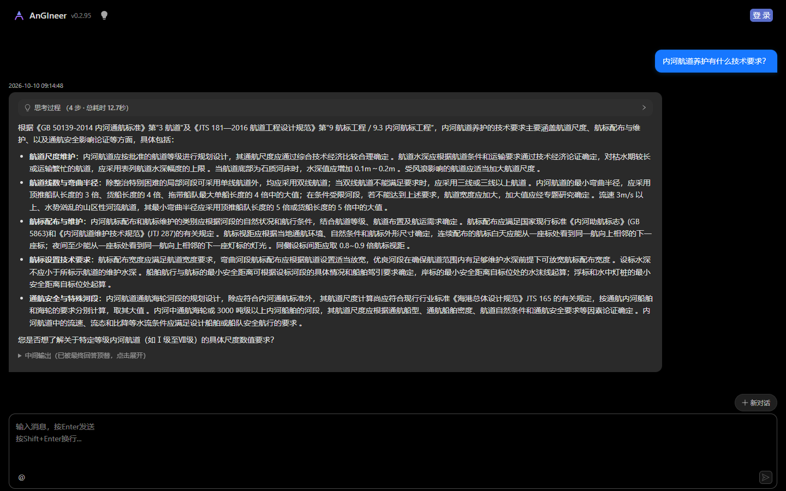
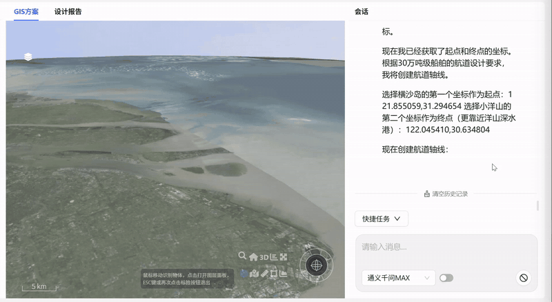
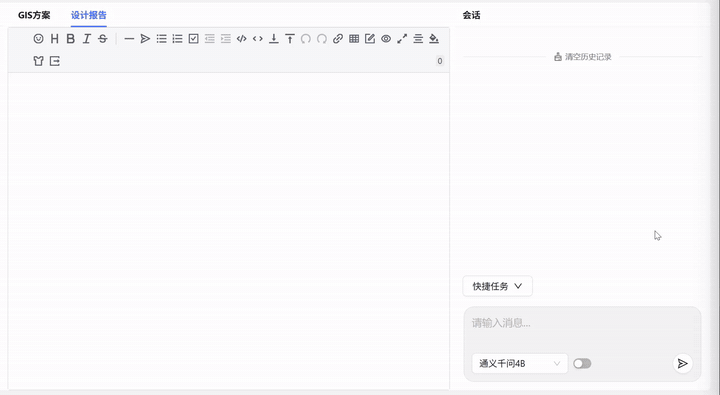
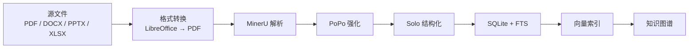
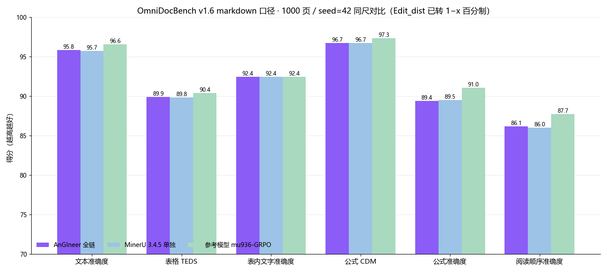
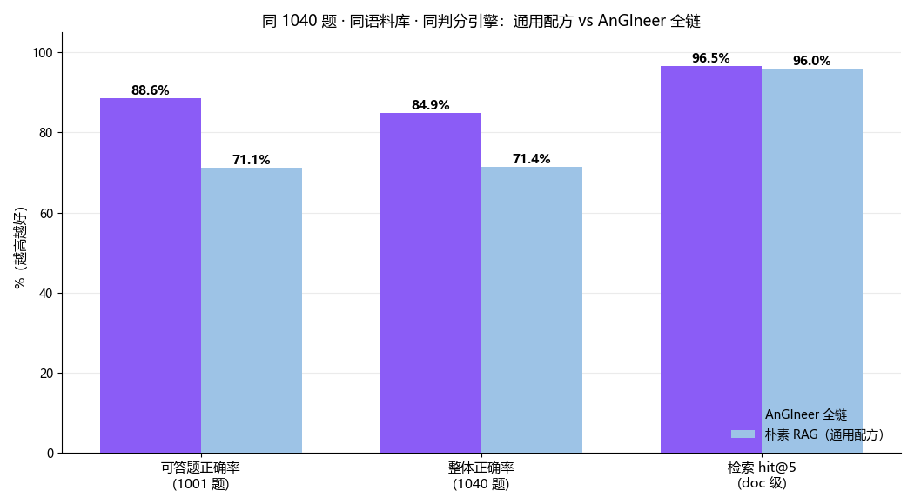
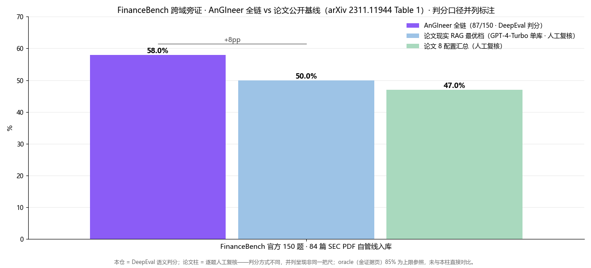
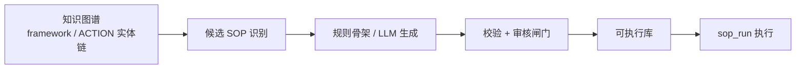
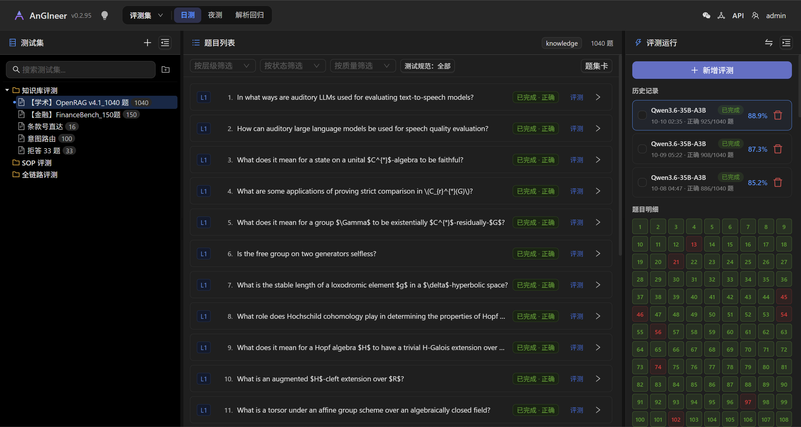
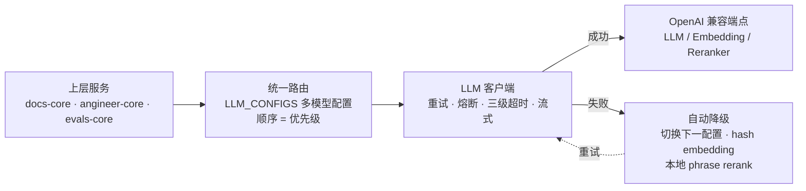

# 🏗️ AnGIneer：工程领域的 AI 工程师

**AnGIneer**（AGI + Engineer）——面向严谨工程领域的 AI 工程师。

## 目标与使命

使用本地 AI 模型（不微调的小型语言模型），完成工程领域的**方案设计、施工组织、绘图**等任务：把规范、SOP、工程工具与地理世界组装成可溯源、可执行的工程智能体。

- **项目愿景**：*Re-engineering the Future of Engineering.*
- **核心理念**：*Human Defines SOP, AnGIneer Executes with Precision.*

🔗 **在线体验：[angineer.cn](https://angineer.cn)**（免登录，打开即用）

***

## 上层应用（不断增加）

### 1️⃣ 专业问答

规范/规程问答，回答带可溯源条款引用（点击跳原文页码），不知道就拒答。

🔗 在线体验：[angineer.cn](https://angineer.cn)（免登录，打开即用）



### 2️⃣ 工程设计 · 航道线设计

对话下达任务，AI 在 GIS 三维地球上自动生成航道轴线，可交互编辑调整。



### 3️⃣ 报告编写

一句话指令，按章节结构自动撰写设计报告（节能/导助航等章节）。



### 4️⃣ 其他

施工组织设计（施组）、晨会纪要等，持续增加中。

***

## 核心技术

### 1️⃣ docs-core：文档结构解析与知识库

九阶段文档解析入库 pipeline，知识库分组分库存储：


```mermaid
flowchart LR
    SRC["源文件<br/>PDF / DOCX / PPTX / XLSX"] --> CV["格式转换<br/>LibreOffice → PDF"]
    CV --> MU["MinerU 解析"]
    MU --> PO["PoPo 强化"]
    PO --> SOLO["Solo 结构化"]
    SOLO --> FTS["SQLite + FTS"]
    FTS --> VEC["向量索引"]
    VEC --> GR["知识图谱"]
```

**语料包导出**：管理后台选组/库一键导出流式 zip 语料包（含正文 sqlite + qdrant 快照，服务端不落盘、可取消、断连自动收尾），包格式按跨环境导入设计——知识库迁移分发零手工拷贝（导入端随语料包通道后续落地）。

两端公开基准背书：

- **语料端 OmniDocBench**（1000 页三方同尺）：markdown 交付面与上游 MinerU 重合（六项差 ≤0.2pp），结构化层（块召回/文本相似度/阅读顺序）全面领先 MinerU 原生；
- **回答端 Open RAG Bench**（1040 题 nightly 门禁）：对比同语料同判分的朴素 RAG 臂，全链可答正确率领先 **17.5 个百分点**（71.1% → 88.6%）。




> 深入阅读：[docs/tech-report.md](docs/tech-report.md) · [docs/angineer-docs/parse-pipeline.md](docs/angineer-docs/parse-pipeline.md)

### 2️⃣ angineer-core：工程可靠 Harness

手写 Agent 循环（零框架）：意图分级 L0–L4 路由、赌博式预检、四路召回 + RRF 融合重排、终答守卫（无证据/外引/半拒答 → 拒答）。**跨域旁证 FinanceBench**（金融域 150 题、同一判分链零改动）：语义正确率 **58.0%**，超过论文公开的现实 RAG 配置最优档 50%。



> 深入阅读：[docs/angineer-core/agent-harness.md](docs/angineer-core/agent-harness.md)

### 3️⃣ sops-core：经验提取与执行

从文档图谱自动提取 SOP（规则骨架/LLM 生成 → 变量黑板依赖提取 → 校验 → 审核闸门 → 可执行库），运行时 `sop_run` 按步骤图执行（计算器/查表/条件分支工具）。自建专业测试集做 benchmark 回归（注册考试题集）。


```mermaid
flowchart LR
    GRAPH["知识图谱<br/>framework / ACTION 实体链"] --> CAND["候选 SOP 识别"]
    CAND --> GEN["规则骨架 / LLM 生成"]
    GEN --> VAL["校验 + 审核闸门"]
    VAL --> LIB["可执行库"]
    LIB --> RUN["sop_run 执行"]
```

### 4️⃣ evals：专业评测引擎

题集管理、异步评测运行、检索（Hit@1/3/5 · MRR）与回答语义判分（judge 模型与被测解耦）、两次运行对比看板；**nightly 门禁**每晚全量回归 + 企微播报，数据正确性每晚重验断言。



### 5️⃣ ai-inference：大模型统一路由

成熟的基础设施模块：多模型 JSON 配置（顺序=优先级、失败自动切换）、重试/熔断/三级超时/流式、Embedding/Reranker 故障自动降级；Prompt 统一资产化（带版本号注册，CI 强制审计）。已上架 PyPI（`angineer-ai-inference`）。


```mermaid
flowchart LR
    APP["上层服务<br/>docs-core · angineer-core · evals-core"] --> ROUTE["统一路由<br/>LLM_CONFIGS 多模型配置<br/>顺序 = 优先级"]
    ROUTE --> CLIENT["LLM 客户端<br/>重试 · 熔断 · 三级超时 · 流式"]
    CLIENT -->|成功| EP["OpenAI 兼容端点<br/>LLM / Embedding / Reranker"]
    CLIENT -->|失败| FAIL["自动降级<br/>切换下一配置 · hash embedding<br/>本地 phrase rerank"]
    FAIL -.->|重试| CLIENT
```

### 6️⃣ engtools：工程工具（预留）

即将开发 GIS 交互 tools——真实空间数据（影像/地形/水文气象）接入与工程计算联动，配合 geo-core 世界底座。

***

## 模块化插件版本

**当前版本：0.2.96** ——拒答判分两级观测：该拒未拒不再一刀切，拆「有据未拒／真幻觉」（证据支持度）与「对／错／边界」（vs 公开 gold 三档，预注册 rubric），口径不变（只加观测字段，score／refusal_correct 与门禁基线可比）；题集挂公开 gold + nightly 报告拒答专项双口径行；/arch 链路图锚点全量校正并新增「评测判分链」节点（守卫补三态 strip 态）；tech-report 扩写（分组分库／知识图谱／Dream Cycle／公开基准成绩）并补拒答两级观测节；README 重排并补产品与对比截图；生产环境件同步（MINERU 并发 2／POPO 超时 900 重试 0／COMPANY 超时 3600／评测并发 5）；完结文档清理 + 悬空引用改挂（17 处）。详见 [CHANGELOG.md](CHANGELOG.md)。

各模块独立仓库各自用 git tag 发布（发版时同步更新本表）：

| 仓库 | 版本 | 说明 |
| :--- | :--- | :--- |
| [AnGIneer](https://github.com/0mao0/AnGIneer) | `v0.2.96` | 主仓库（产品迭代基线） |
| [angineer-docs-ui](https://github.com/0mao0/angineer-docs-ui) | `v0.3.1` | 知识库前端组件库（npm: @angineer/docs-ui） |
| [angineer-aichat-ui](https://github.com/0mao0/angineer-aichat-ui) | `v0.2.2` | 对话前端组件库（npm: @angineer/aichat-ui） |
| [angineer-smartree-ui](https://github.com/0mao0/angineer-smartree-ui) | `v0.1.3` | 通用树组件库 SmartTree（npm: @angineer/smartree） |
| [angineer-table-ui](https://github.com/0mao0/angineer-table-ui) | `v0.1.4` | 通用表格组件库 DataTable（npm: @angineer/table-ui） |
| [angineer-ai-inference](https://github.com/0mao0/angineer-ai-inference) | `v0.2.3` | Python AI 推理客户端库 |
| [angineer-core](https://github.com/0mao0/angineer-core) | `v0.1.2` | Python 问答编排内核（Agent Harness：意图分级 / 工具调用 / 证据守卫） |
| [angineer-tree-core](https://github.com/0mao0/angineer-tree-core) | `v0.1.0` | Python 树节点存储层（sqlite：CRUD / 移动重排 / 作用域隔离） |
| [angineer-docs-core](https://github.com/0mao0/angineer-docs-core) | `v0.1.2` | Python 文档解析入库引擎（九阶段管线 + 五路检索 + 导出；PoPo 随包） |

***

## 部署方式

要求：Python 3.10+、Node.js 20+、pnpm 11、LibreOffice（DOCX/PPTX/XLSX 转 PDF）。

```bash
git clone https://github.com/0mao0/AnGIneer.git
cd AnGIneer
pnpm install && pnpm services:install
cp .env.example .env   # 至少配置 LLM_CONFIGS / MINERU_CONFIGS / EMBEDDING_CONFIGS / RERANKER_CONFIGS
```

```powershell
.\start.ps1            # Windows 一键启动（用户台 3005 · 管理台 3002）
```

```bash
cd docker && docker compose up -d --build   # Docker 部署（前端 8080 · API 8790/8791 · Qdrant 6333）
```

> 完整配置项、外部 API 调用示例、评测命令见 [docs/tech-report.md §10](docs/tech-report.md)。

***

## Roadmap

| 版本 | 主题 | 状态 |
| :--- | :--- | :--- |
| **v0.1** | 基础框架：解析入库、图谱、SOP 引擎、L0–L4 分级、对话、评测 | ✅ 已完成 |
| **v0.2** | Docs 模块完成：结构化 pipeline 双端基准背书、nightly 门禁、angineer.cn 上线 | 🔄 迭代中（当前 v0.2.96，预计收版 v0.2.99） |
| **v0.3** | SOP 自进化：图谱自动生成 → 审核闸门 → 执行轨迹反哺，支撑注册考题 | 🚧 规划中（链路骨架已存在） |
| **v0.4** | GIS × CAD：真实空间数据接入、断面/土方计算、DWG/DXF 出图算量 | 🚧 规划中（geo-core / engtools 骨架已存在） |
| **v0.5** | 报告编制：工可/初设等正式设计报告自动编制（Markdown / Word / PDF） | 🚧 规划中 |
| **v1.0** | 正式版：多专业覆盖、精度与稳定性、SaaS 化多租户 | 🚧 目标 |

> 各模块技术细节（架构图、链路、数据模型、开发约定）见 [docs/tech-report.md](docs/tech-report.md)。

***

*AnGIneer - Re-engineering the Future of Engineering.*
