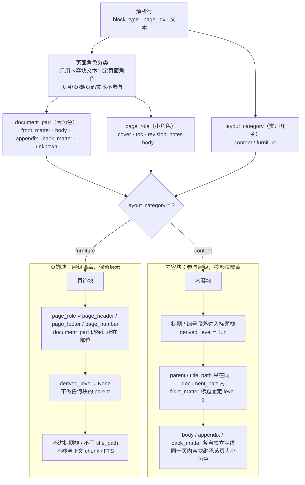

# 块角色与层级隔离设计（Block Role & Hierarchy Isolation）

> 日期：2026-08-07
> 状态：设计定稿（待实施）

## 1. 背景与问题

当前 `solo_engine` 建块时，页眉（`page_header`）、页脚（`page_footer`）、页码（`page_number`）等“页饰块”会被当作普通内容参与层级推断：

- 任何非标题块都会拿当前标题栈最深一层当 parent，再执行 `derived_level = parent_level + 1`，导致页饰块被赋予 2~6 级层级并挂到内容标题下面；
- 页饰文本（如“免费标准下载网(www.freebz.net)”广告水印）参与页面角色关键词判定，可能污染 cover/toc/body 等角色；
- 树/列表视图把页饰块当普通行显示，广告水印直接出现在界面里。

根因：**缺少“类别”这一维度**。层级推断没有先区分“内容块 / 页饰块”，角色分类也没有把页饰文本排除在外。

## 2. 目标与非目标

### 目标

1. 每个块先有稳定类别（`layout_category`），层级只在内容块内部成立；
2. `document_part` / `page_role` 表达“在文档哪个部位、在页面里扮演什么小角色”，与层级值正交；
3. 页饰块不参与内容层级，不获得 level、不做任何块的 parent、不进标题栈；
4. 层级按 `document_part` 隔离：front_matter / body / appendix / back_matter 各自独立定级，parent 不跨部位；
5. 页饰块保留在图谱与展示层，但树/列表默认隐藏，提供“显示页眉页脚”开关；
6. 角色分类只读取内容块文本，页饰文本不参与判定。

### 非目标

- 不删除页饰块，不做“广告水印内容识别”（页饰统一按类别处理，不区分广告与否）；
- 不做 `document_part` 筛选器 UI（如“只看正文/只看附录”），本轮仅透传字段；
- 不改 `title_level_refiner`、`build_canonical_outlines`（树仍从 level 1 开始）；
- 不改图谱视图行为（本轮不为其新增开关）。

## 3. 字段模型

每个块携带三个**正交**字段：

| 字段 | 取值 | 含义 |
|---|---|---|
| `layout_category` | `content` / `furniture` | 是否内容块：层级推断的总开关 |
| `document_part`（大角色） | `front_matter` / `body` / `appendix` / `back_matter` / `unknown` | 块位于文档哪个部位 |
| `page_role`（小角色） | 内容块：`cover` / `publication_page` / `notice` / `revision_notes` / `toc` / `preface` / `body` / `appendix` / `back_matter` / `unknown`；页饰块：`page_header` / `page_footer` / `page_number` / `header` / `footer` | 块在页面里扮演的小角色 |

规则：

- `layout_category` 由 `block_type` 推导：`{page_header, page_footer, page_number, header, footer}` → `furniture`，其余 → `content`；
- 页饰块的 `document_part` 仍保留所在页部位（正文页的页脚 = `body/page_footer`），便于知道它属于哪一段文档；
- 页饰块的 `page_role` 不再继承页面角色，而是标成自身类型；
- `derived_level` 只在 `layout_category == "content"` 的块上存在，页饰块恒为 `None`。

`PageRole` 枚举扩展成员：`PAGE_HEADER`、`PAGE_FOOTER`、`PAGE_NUMBER`、`HEADER`、`FOOTER`。

## 4. 页面角色分类规则

`classify_page_roles` 维持“页面级 → 部位/角色”的既有框架，做两处收紧：

1. **页饰文本排除**：`_page_text` 只聚合内容块（`layout_category == "content"`）的文本；页眉/页脚/页码文本不参与关键词匹配、编号标题检测；
2. **未知页部位兜底**：页面角色为 `unknown` 时，`document_part` 按位置兜底——`body_start` 之前为 `front_matter`，之后为 `body`；`page_role` 保持 `unknown`。

保留既有规则：

- `toc_pages`（目录页检测）与 `body_start`（第一个编号标题页）机制不变；
- 附录/后记判定只认标题行（“附录”开头 / 标题含“用词说明、条文说明”），正文交叉引用不误判（已实现）。

## 5. 层级推断规则（solo_engine）

建块循环中，按 `layout_category` 分流：

### 内容块（content）

- 参与标题栈、`derived_level`、`parent_uid`、`title_path`、编号锚点（`number_anchor_uid` / `recent_struct_anchor_uid`）；
- `parent_uid` 只在同一 `document_part` 内成立：`document_part` 变化（如 front_matter → body、body → appendix）时重置标题栈与编号锚点，标题父子关系不跨部位；
- front_matter 页标题固定 `derived_level = 1`（part 基线，已实现）；
- 编号段落按既有规则参与结构标题推断（不改变现状）。

### 页饰块（furniture）

- `derived_level = None`、`parent_uid = None`、`title_path = None`；
- 不写入标题栈、不写入 `derived_level_by_uid`、不更新任何编号锚点；
- 不做公式解释的关联目标或续接目标；
- 保留既有“页眉/页码重置跨页公式解释续接”的跨页防护行为（该行为只防误连，不参与层级）。

## 6. 数据流与透传

```text
solo_engine 建块（写 layout_category / document_part / page_role）
  → doc_blocks_graph.jsonl 节点
  → CanonicalBlock（models/types.py）
  → canonical_builder / graph_rebuilder / rows_projection payload
  → 前端 DocBlockNode
```

- `models/types.py` 的 `CanonicalBlock` 新增 `layout_category`（`document_part` / `page_role` 已存在）；
- `canonical_builder.py`、`graph_rebuilder.py`、`rows_projection.py` 透传 `layout_category`；
- 前端 `DocBlockNode` 新增三个可选字段：`layout_category` / `document_part` / `page_role`，老数据缺字段时兼容。

## 7. 前端设计

### 统一判断

`packages/docs-ui/src/utils/knowledge.ts` 新增：

- `FURNITURE_BLOCK_TYPES: ReadonlySet<string>`（`header/footer/page_header/page_footer/page_number`）；
- `isFurnitureNode(node)`：优先 `layout_category === "furniture"`，老数据回退到 `FURNITURE_BLOCK_TYPES`。

将 `useParsedPdfViewer.ts`、`useWorkspaceLinkage.ts` 中散落的页饰硬编码名单替换为 `isFurnitureNode`，保持既有行为。

### 树/列表显示

- `Preview_IndexTree` 的可见行默认过滤 `layout_category == "furniture"` 的节点；
- 工具栏新增“显示页眉页脚”开关，默认关闭，状态存 localStorage（key：`docs-ui.show-furniture`）；
- 开关打开时页饰行以弱化样式显示（次要文字、不进入 outline/层级缩进），便于排查。

### 其他视图

- PDF 视图：维持现状（本来就排除页饰）；
- 图谱视图：本轮不新增开关，保持现状。

## 8. 测试策略

### 后端（pytest）

- 分类器：页饰文本不参与角色判定（如正文页脚含“条文说明”不改变 body 角色）；未知页部位兜底；
- solo_engine：页饰块 `derived_level is None`、`parent_uid is None`；跨部位标题不互为 parent；真实文档回归（船闸规范 / 海港1 / 海港2）前置页 level=1、页饰无层级；
- 透传：canonical / payload 含 `layout_category`。

### 前端

- `vue-tsc --noEmit` 类型检查通过；
- 手测：树/列表默认不显示页饰，开关打开后显示且弱化，localStorage 持久化。

## 9. 实施顺序建议

1. 后端：字段模型 + 角色分类收紧（页饰文本排除、未知页兜底）；
2. 后端：solo_engine 层级分流（页饰隔离、部位隔离）；
3. 后端：透传 `layout_category`（types / canonical / graph / rows_projection）；
4. 前端：类型 + `isFurnitureNode` + 替换硬编码；
5. 前端：树/列表默认过滤 + 显示开关；
6. 全量回归（docs-core pytest + docs-ui vue-tsc）。

## 10. 架构图


