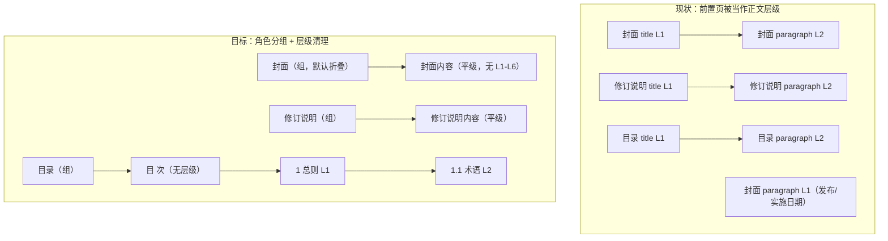

# 前置部分角色分组与层级清理设计（Front-Matter Role Group & Hierarchy Cleanup）

> 日期：2026-08-07
> 状态：已实施（2026-08-07 追加部位状态机兜底）
> 关联设计：[block-role-hierarchy-design.md](./block-role-hierarchy-design.md)

## 1. 背景与问题

当前树形视图（`Preview_IndexTree`）把 `front_matter` 内容当作正文层级展示：

- 封面段落出现 L1/L2 混排，有的挂到封面标题下，有的独立成根；
- 修订说明、发布通知等页面的段落被挂成标题的 L2 子级；
- 目录页若被拆成多行，会冒出一大批 L1–L6 块；
- 这些层级是“正文式层级推断”的产物，对前置页没有语义意义。

根因有两层：

1. **数据层**：`solo_engine` 没有区分前置页的层级语义——非目录前置页内容不应参与正文式标题栈/编号锚点；
2. **展示层**：树没有利用已有的 `document_part` / `page_role` 字段做聚合。

PoPo/MinerU 已给出块类型（`title`/`paragraph`/`header`/`page_number` 等），step04 已给出
`document_part` / `page_role` / `layout_category`，本设计不新增字段。

## 2. 目标与非目标

### 目标

1. 树形视图把 `front_matter` 内容按 `page_role` 聚成可折叠组：
   `封面`、`出版信息`、`发布通知`、`修订说明`、`目录`、`前言`、`其他前置页`；
2. 非目录前置页内容不再参与正文式层级推断：
   `derived_level = None`、`parent_uid = None`、`title_path = None`；
3. 目录组保留 TOC 条目内部层级（按编号深度 L1–L6），目录标题自身不带层级；
4. 分组壳是展示层虚拟节点：不写入图数据，不影响编辑、检索、图谱。

### 非目标

- 不做列表视图分组（列表保持平铺卡片，仅受益于层级清理后不再显示假的 L1/L2）；
- 不新增 `page_role` 枚举：`unknown` 前置页统一归入“其他前置页”；
- 不做后端虚拟分组节点（避免无 bbox 节点进入图/编辑/检索链路）；
- 不考虑旧数据兼容（开发期直接重跑 structure 即可）。

## 3. 数据层设计（solo_engine）

在 solo_engine 建块循环的 `document_part / page_role` 分流处追加规则：

### 3.1 front_matter 且 page_role ≠ toc

- 所有内容块（含 `title`）一律：
  `derived_level = None`、`parent_uid = None`、`title_path = None`；
- 不写标题栈、不写编号锚点、不更新 `recent_struct_anchor_uid`；
- 页饰行为不变（本身已是 None）。

### 3.2 page_role = toc（目录）

- “目 次 / 目录”标题：`derived_level = None`（组内标题，不参与条目编号层级）；
- TOC 条目：`derived_level = infer_struct_level(text)`：
  “1” → L1、“1.1” → L2、……、“附录 A” → L1；
- `parent_uid` 沿用现有 `toc_root_uid` / `toc_number_anchor_uid` 逻辑，父子关系只在目录组内成立；
- `title_path` 保持 `None`（分组壳是虚拟节点，不进入 title_path）；
- 无编号条目（如“引用标准名录”）挂到目录根，`derived_level = None`。

### 3.3 unknown 前置页

`body_start` 之前未识别角色的页面（如编制人员名单页）：

- 内容与 3.1 同样扁平化；
- 展示层归入“其他前置页”。

### 3.4 数据流

不新增字段，canonical builder / graph_rebuilder / rows_projection 的现有透传不变。

### 3.5 部位状态机（纯附录 / 跨页表格兜底）

`page_role` 不再依赖“先找到正文起始页”：

- 独立检测部位强标记：数字编号 `title` → `body`；`title` 以“附录”开头 → `appendix`；
  `title` 含“用词说明 / 条文说明” → `back_matter`；
- 按页序维护 `active_part`：命中标记即切换；无标记的续页（续表、空页、只有页眉页码的页）继承当前部位；
- 首个部位之前的页仍走 front_matter 分类（cover / unknown 等）；
- 纯附录文档（如“跨页表格.pdf”）因此整体归入 `appendix`，不再落到“封面 / 其他前置页”。

## 4. 展示层设计（前端）

### 4.1 共享工具

在 `packages/docs-ui/src/utils/knowledge.ts`（或独立 `treeGrouping.ts`）新增：

- `FRONT_MATTER_GROUP_LABELS`：
  `cover → 封面`、`publication_page → 出版信息`、`notice → 发布通知`、
  `revision_notes → 修订说明`、`toc → 目录`、`preface → 前言`、
  `unknown → 其他前置页`；
- `frontMatterGroupId(role)`：返回虚拟 id，如 `fm-group:toc`；
- `buildDisplayRoots(roots, nodeMap, childrenMap)`：
  - `front_matter` 节点按 `page_role` 聚成组；
  - 组 children = 该角色下的顶层内容块（`parent_uid` 缺失，或 parent 不属于同角色）；
  - 组按成员最小 `page_idx` 排序（文档顺序）；
  - 非 `front_matter` 根节点原样透传；
  - 缺 `page_role` 的节点不分组；
  - 页饰按所在页的页面角色归入对应组（先由内容块建立“页码 → 页面角色”映射），
    不计入组内“N 项”，`showFurniture` 关闭时不显示。

### 4.2 Preview_IndexTree 组行

- `flatRows` 支持虚拟组行：`depth = 0`，`hasChildren` = 组内可见成员数，
  `isExpanded` = `expandedNodeIds.has(groupId)`；
- 展开后先遍历组 children（`depth = 1`），再走原 `childrenMap`；
- 组行样式：文件夹图标 + 角色名 + “N 项”chip（N = 该角色内容块总数，不含页饰）；
- 组行无 L tag、无页码 tag、无勾选框、无编辑按钮、无右键层级菜单；
- 组行整行点击 toggle，不触发 PDF 高亮选中；组 id 不 emit `toggle-tree-expand`。

### 4.3 默认折叠与自动展开

- 加载图数据时：真实根节点照旧展开，前置组 id 不加入 `expandedNodeIds`（默认折叠）；
- `expandAncestors` 时：若节点 `document_part = front_matter`，追加其所属组 id，
  保证从搜索/PDF 高亮跳进组内节点时自动展开所属组。

### 4.4 列表视图与页饰开关

- `Preview_IndexList` 保持现状，不做分组；
- “显示页饰”打开时，页饰以现有弱化行渲染在**所在页对应的分组内**（如封面页的页眉显示在“封面”组里）；
  正文页没有分组壳，页饰仍以普通弱化行显示。

## 5. 边界与兜底

- 同一角色跨多页（如目录占 3 页）：合并为一个组，成员按 `page_idx / block_seq` 排序；
- 纯附录 / 无数字正文的文档：不要求存在 `body_start`，由部位状态机直接落 `appendix` / `back_matter`；
- 某角色组内无内容块（全部为页饰）：组不显示；
- `page_role` 缺失：不分组，按现状显示（开发期兜底，不为旧数据做迁移）；
- 分组壳 id 使用 `fm-group:` 前缀，避免与真实 block_uid 冲突。

## 6. 测试策略

### 后端（pytest）

- front_matter 非 toc 内容块：`derived_level / parent_uid / title_path` 均为 None
  （覆盖封面、出版信息、通知、修订说明、前言、unknown）；
- toc：目录标题无层级；条目按编号深度得 L1–L6；父子关系仅在目录组内；
- 真实文档回归：船闸规范、海港规范前置页全平、目录组层级正确；
- 更新既有 `title_level` / `hierarchy` 相关断言。

### 前端

- `vue-tsc -b` 0 错误；
- 手测船闸/海港真实文档：打开树只见几个前置组（默认折叠）；
  展开目录组后条目层级正确；搜索/PDF 高亮跳转自动展开所属组；
  页饰开关行为不受影响。

## 7. 实施顺序

1. 后端：solo_engine 前置页扁平化 + TOC 层级修正 → pytest；
2. 前端：共享工具 `buildDisplayRoots` + 类型；
3. 前端：`Preview_IndexTree` 组行渲染/交互 + `useParsedPdfIndexTree` 默认折叠/自动展开；
4. 回归：pytest + vue-tsc + 真实文档手测。

## 8. 架构图

