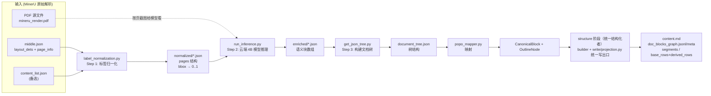
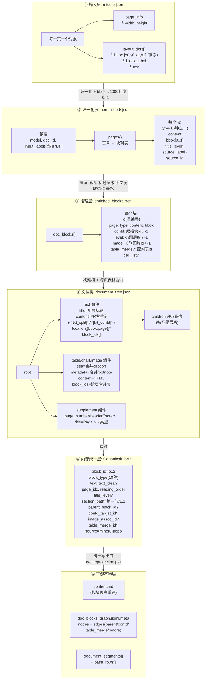
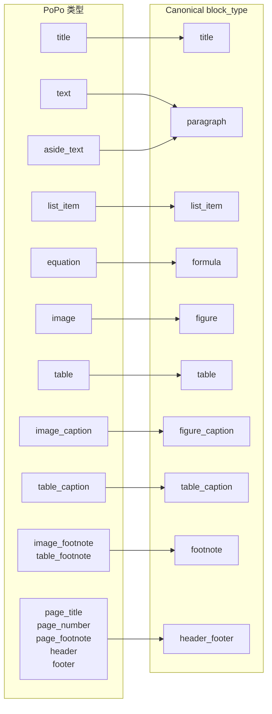
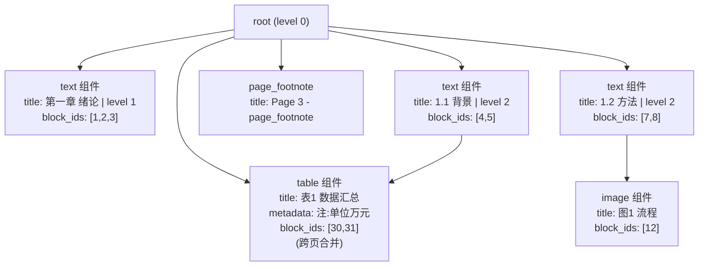

# MinerU-Popo 管线图解

> 来源: `services/docs-core/src/popo` (submodule, commit 97d5601)
> 接线层: `services/docs-core/src/docs_core/read/popo_pipeline.py`

## 1. PoPo 整体管线

## 2. 数据流转 + 各层 Schema（字段视图）

## 3. 类型映射图（PoPo 16 种 → Canonical 10 种）

## 4. 文档树结构示意（实例）

## 要点

- **输入是页面级布局 → 归一化 → 模型推理出语义 → 树 → 映射成内部统一块（CanonicalBlock）→ structure 阶段统一写出口生成下游产物**
- 中间任何一层都只是数据格式转换，不改语义
- 跨页表格合并发生在第 ④ 层之前（`merge_cross_page_tables`，commit 97d5601 修复）
- popo 不再经 `popo_projection.py`（阶段三已删除）：graph/segments/base_rows 由 `write/projection.py` 从 CanonicalDocument 统一生成，表格 HTML/math_content 经 derived_rows 落库
