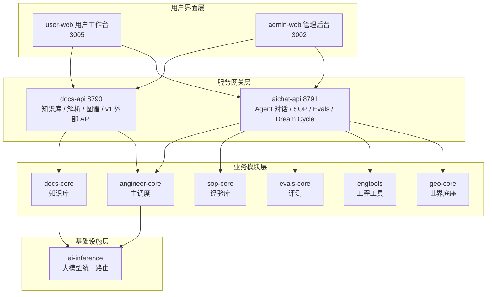
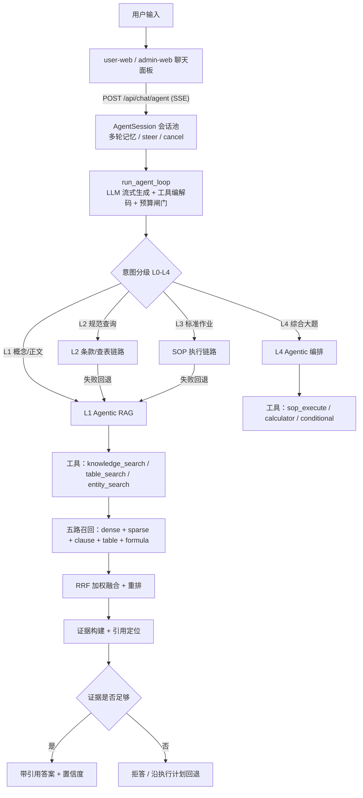
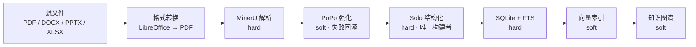
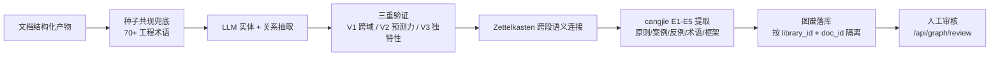
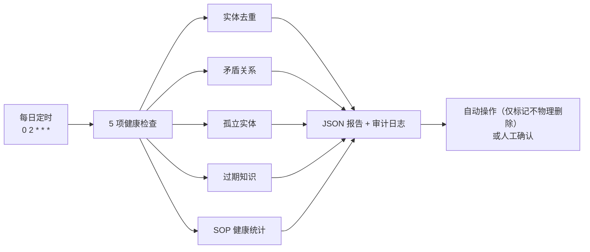
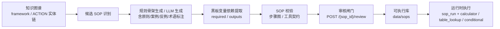
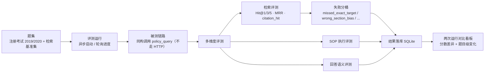
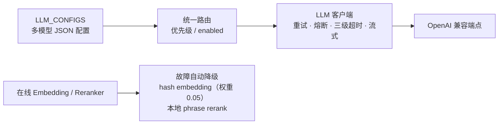

# AnGIneer 技术报告

> 版本基线：**v0.2.7** · 更新日期：2026-08-21
>
> 本文是系统级技术报告：先用一张模块关系图交代整体架构，再按模块讲清各自的核心链路。各模块的深度技术细节请跳转文内链接（详见各章末尾"深入阅读"）。

---

## 1. 核心架构

### 1.1 模块关系图



> 说明：AnGIneer-TreeCore 是树操作的通用基础设施（零外部依赖），不参与业务模块关系，故未列入上图。

### 1.2 对外服务边界

| 模块 | 对外暴露 | 鉴权方式 |
| :--- | :--- | :--- |
| **docs-api** | `/api/v1/*`（文档解析/产物/内容） | `X-API-Key`（管理后台签发，绑定库隔离） |
| **docs-api** | `/api/knowledge`、`/api/graph`（知识库/图谱） | 内部代理（前端经 vite/nginx 转发） |
| **aichat-api** | `/api/chat/agent`、`/api/sops`、`/api/evals`、`/api/dream-cycle` | 内部代理（不对外直连） |
| **user-web / admin-web** | 浏览器访问的 Web 界面 | 生产环境：管理端 IP 白名单 + Basic Auth |

两个 FastAPI 网关默认只绑定本机回环（`127.0.0.1`），公网只暴露 nginx 80 端口。

---

## 2. AnGIneer-Core 主调度模块

### 2.1 Agent 化问答链路



### 2.2 分级路由策略

| 层级 | 问题类型 | service_mode | 主处理链路 |
| :--- | :--- | :--- | :--- |
| **L0** | 闲聊寒暄 | `casual_chat` | 直接 LLM 对话，不检索 |
| **L1** | 概念解析 / 定位问答 | `semantic_retrieval` | 多路召回 → 融合 → LLM 基于证据作答 |
| **L2** | 条款应用 / 规范查询 | `structured_lookup` | 条款/表格结构化查证 → 失败回退 L1 |
| **L3** | 标准工程计算 | `standard_sop` | SOP 召回 → 精排 → 参数抽取 → 执行 |
| **L4** | 复杂复合任务 | `dynamic_orchestration` | Agent 循环动态组合多能力链路 |

> 深入阅读：[docs/agent-harness.md](agent-harness.md)（L0~L4 策略、Attempt 状态机、事件协议、守卫）

---

## 3. AnGIneer-Docs 知识库模块

### 3.1 一体化文档解析管线



要点：hard 阶段失败终止后续、soft 阶段失败仅标记自身；支持单阶段重试、断点恢复、GPU 排队与阶段级可视化。

### 3.2 知识图谱模块



### 3.3 自进化模块（Dream Cycle）



> 深入阅读：[docs/parse-pipeline.md](parse-pipeline.md) · [docs/popo-pipeline.md](popo-pipeline.md) · [docs/knowledge-data-model.md](knowledge-data-model.md)

---

## 4. AnGIneer-SOPs 经验库模块

### 4.1 SOP 自动生成链路



### 4.2 主要能力

| 能力 | 说明 |
| :--- | :--- |
| 自动生成 | 从文档图谱识别 framework 路径或 ACTION 实体链生成 SOP JSON |
| 解析引擎 | Markdown SOP → 结构化执行计划（6 种工具类型） |
| 条件分支 | 精确匹配 → 排除法 → LLM 语义匹配三级降级 |
| 审核与审计 | LLM 生成的 SOP 需审核后才进入可执行库，全程留痕 |

> 相关规划文档：[docs/sop-extractor-plan.md](sop-extractor-plan.md)

---

## 5. AnGIneer-Evals 评测引擎模块

### 5.1 评测链路



> 深入阅读：[docs/retrieval-chain.md](retrieval-chain.md)（检索评测指标与失败分桶的踩坑记录）

---

## 6. AnGIneer-AI 大模型统一路由模块



要点：`ai-inference` 是 AI 推理唯一真相源（零外部依赖）；Prompt 统一资产化（`prompts/` 带版本号注册），改动 prompt 必须升版本号，CI 强制审计。

> 深入阅读：[docs/llm-gateway.md](llm-gateway.md)

---

## 7. 技术架构与仓库布局

### 7.1 依赖方向（强约束）

```text
ai-inference（AI 推理唯一真相源，零外部依赖）
    ↑
angineer-core / docs-core / evals-core / sop-core / engtools / geo-core
    ↑
docs-api / aichat-api（服务网关）
    ↑
user-web / admin-web（用户界面层）
```

### 7.2 仓库布局

| 目录 | 内容 |
| :--- | :--- |
| `apps/` | user-web（3005）、admin-web（3002）、shared（端口契约 + API 客户端） |
| `packages/` | docs-ui / aichat-ui / sop-ui / evals-ui / geo-ui / engtools-ui / ui-kit |
| `services/` | 两个 FastAPI 网关 + ai-inference / tree-core / angineer-core / docs-core / sop-core / evals-core / geo-core / engtools |
| `data/` | knowledge_base / sops / evals / dream_cycle / api_keys.sqlite |
| `docs/` | 本报告与各模块技术文档 |

---

## 8. 路线图

| 阶段 | 已完成 / 进行中 | 未来 |
| :--- | :--- | :--- |
| **v0.1** | 规范问答基础版：文档解析入库、知识图谱、SOP 引擎、L0-L4 分级、AI 对话、评测框架 | — |
| **v0.2** | Agent 化问答链路、五路检索 + 融合重排、SOP 审核/审计、Prompt 资产化、一体化文档解析管线 + PoPo 强化、注册考试题集评测、Dream Cycle 巡检（当前基线 v0.2.7） | — |
| **v0.3** | geo-core GIS 断面算量工具、GIS 视图骨架 | Cesium 三维世界模型、地理信息自主查询、空间计算联动 |
| **v0.4** | — | 设计报告自动编制（工可 / 初设） |
| **v0.5** | — | CAD 出图算量闭环（**正式版**） |
| **v1.0+** | — | 多专业覆盖、精度与稳定性、SaaS 化多租户 |
