# AnGIneer 技术报告

> 版本基线：**v0.2.96** · 更新日期：2026-10-10
>
> 本文是系统级技术报告：先用一张模块关系图交代整体架构，再按模块讲清各自的核心链路。各模块的深度技术细节请跳转文内链接（详见各章末尾"深入阅读"）。

---

## 1. 核心架构

### 1.1 模块关系图

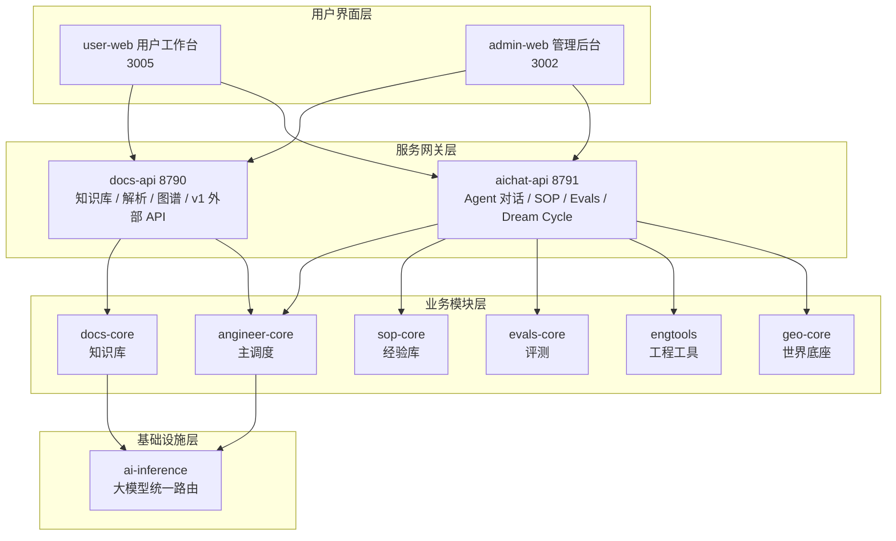
```mermaid
flowchart TB
    subgraph UI["用户界面层"]
        UW["user-web 用户工作台<br/>3005"]
        AW["admin-web 管理后台<br/>3002"]
    end
    subgraph GW["服务网关层"]
        DA["docs-api 8790<br/>知识库 / 解析 / 图谱 / v1 外部 API"]
        AA["aichat-api 8791<br/>Agent 对话 / SOP / Evals / Dream Cycle"]
    end
    subgraph BIZ["业务模块层"]
        CORE["angineer-core<br/>主调度"]
        DOCS["docs-core<br/>知识库"]
        SOP["sop-core<br/>经验库"]
        EVAL["evals-core<br/>评测"]
        TOOL["engtools<br/>工程工具"]
        GEO["geo-core<br/>世界底座"]
    end
    subgraph BASE["基础设施层"]
        AI["ai-inference<br/>大模型统一路由"]
    end

    UW --> DA & AA
    AW --> DA & AA
    DA --> DOCS & CORE
    AA --> CORE & SOP & EVAL & TOOL & GEO
    CORE --> AI
    DOCS --> AI
```

> 说明：AnGIneer-TreeCore 是树操作的通用基础设施（零外部依赖），不参与业务模块关系，故未列入上图。

### 1.2 对外服务边界

| 模块 | 对外暴露 | 鉴权方式 |
| :--- | :--- | :--- |
| **docs-api** | `/api/v1/*`（文档解析/产物/内容） | `X-API-Key`（管理后台签发，绑定库隔离） |
| **docs-api** | `/api/knowledge`、`/api/graph`（知识库/图谱） | 内部代理（前端经 vite/nginx 转发） |
| **aichat-api** | `/api/chat/agent`、`/api/sops`、`/api/evals`、`/api/dream-cycle` | 内部代理（不对外直连） |
| **user-web / admin-web** | 浏览器访问的 Web 界面 | 生产环境：管理端账号密码登录（is_admin 会话鉴权） |

两个 FastAPI 网关默认只绑定本机回环（`127.0.0.1`），公网只暴露 nginx 80 端口。

---

## 2. AnGIneer-Core 主调度模块

### 2.1 Agent 化问答链路

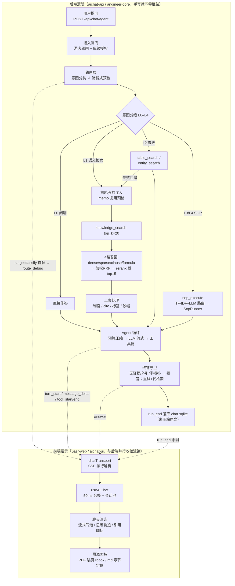
```mermaid
flowchart TB
    subgraph BE["后端逻辑（aichat-api / angineer-core，手写循环零框架）"]
        U["用户提问<br/>POST /api/chat/agent"] --> GATE["接入闸门<br/>游客轮闸 + 库级授权"]
        GATE --> ROUTE["路由层<br/>意图分类 ∥ 赌博式预检"]
        ROUTE --> LEVEL{"意图分级 L0–L4"}
        LEVEL -->|"L0 闲聊"| L0["直接作答"]
        LEVEL -->|"L1 语义检索"| INJ["首轮强检注入<br/>memo 复用预检"]
        INJ --> KS["knowledge_search top_k=20"]
        KS --> PIPE["4路召回 dense/sparse/clause/formula<br/>→ 加权RRF → rerank 截 top15"]
        PIPE --> TABLE["上桌处理<br/>判官 / cite / 标签 / 软帽"]
        LEVEL -->|"L2 查表"| TS["table_search /<br/>entity_search"]
        TS -->|"失败回退"| INJ
        LEVEL -->|"L3/L4 SOP"| SOP["sop_execute<br/>TF-IDF+LLM 路由 → SopRunner"]
        L0 & TABLE & TS & SOP --> LOOP["Agent 循环<br/>预算压缩 → LLM 流式 → 工具批"]
        LOOP --> GUARD["终答守卫<br/>无证据/外引/半拒答 → 拒答；重试+代检索"]
        GUARD --> ENDN["run_end 落库 chat.sqlite<br/>（未压缩原文）"]
    end
    subgraph FE["前端展示（user-web / aichat-ui，与后端并行收帧渲染）"]
        TRANS["chatTransport<br/>SSE 按行解析"] --> STATE["useAIChat<br/>50ms 合帧 + 会话池"]
        STATE --> REND["聊天渲染<br/>流式气泡 / 思考轨迹 / 引用圆标"]
        REND --> DOC["溯源面板<br/>PDF 跳页+bbox / md 章节定位"]
    end
    ROUTE -.->|"stage:classify 首帧 → route_debug"| TRANS
    LOOP -.->|"turn_start / message_delta / tool_start/end"| TRANS
    GUARD -.->|"answer"| TRANS
    ENDN -.->|"run_end 末帧"| TRANS
```

> 同一张图的可交互版（hover 机制详情 + 源码锚点 + 问题标记 + 意图线收起/展开）：管理端右上角「链路架构图」入口（`/arch`）。

### 2.2 分级路由策略

| 层级 | 问题类型 | service_mode | 主处理链路 |
| :--- | :--- | :--- | :--- |
| **L0** | 闲聊寒暄 | `casual_chat` | 直接 LLM 对话，不检索 |
| **L1** | 概念解析 / 定位问答 | `semantic_retrieval` | 多路召回 → 融合 → LLM 基于证据作答 |
| **L2** | 条款应用 / 规范查询 | `structured_lookup` | 条款/表格结构化查证 → 失败回退 L1 |
| **L3** | 标准工程计算 | `standard_sop` | SOP 召回 → 精排 → 参数抽取 → 执行 |
| **L4** | 复杂复合任务 | `dynamic_orchestration` | Agent 循环动态组合多能力链路 |

> 深入阅读：[angineer-core/agent-harness.md](angineer-core/agent-harness.md)（L0~L4 策略、Attempt 状态机、事件协议、守卫）

---

## 3. AnGIneer-Docs 知识库模块

### 3.1 一体化文档解析管线

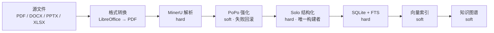
```mermaid
flowchart LR
    SRC["源文件<br/>PDF / DOCX / PPTX / XLSX"] --> CV["格式转换<br/>LibreOffice → PDF"]
    CV --> MU["MinerU 解析<br/>hard"]
    MU --> PO["PoPo 强化<br/>soft · 失败回滚"]
    PO --> SOLO["Solo 结构化<br/>hard · 唯一构建者"]
    SOLO --> FTS["SQLite + FTS<br/>hard"]
    FTS --> VEC["向量索引<br/>soft"]
    VEC --> GR["知识图谱<br/>soft"]
```

要点：hard 阶段失败终止后续、soft 阶段失败仅标记自身；支持单阶段重试、断点恢复、GPU 排队与阶段级可视化。

> **PoPo 注意事项（更新上游时务必保留本地定制）**
>
> `services/docs-core/src/popo` 已内化为普通目录（原 submodule，2026-09-09 移除；MinerU-Popo fork，MIT 协议）。本地已将 `post_processing/model_utils.py` 中的硬编码 `url=""` / `key=""` 改为读取 `POPO_CONFIGS`（JSON 端点列表：`[{"name","url","api_key","model"}, ...]`，数组顺序=优先级，连接失败/超时自动切下一项；未配置返回空、不打任何请求），并支持 `POPO_API_TIMEOUT`（默认 300s）与 `POPO_MAX_TOKENS`（默认 4096）。**若不保留此修改，PoPo 推理会请求打到 api.openai.com（国内 DNS 污染导致挂死）或空 url 报错。** 上游同步点与保留定制的细节见 `services/docs-core/src/popo/UPSTREAM_SYNC.md`。

### 3.2 分组分库存储

组是物理隔离单位——每组一套正文 sqlite + 一个 qdrant 集合，按业务域（外服生产 / 内测评测）互不干扰；库是逻辑单位——一个知识库只是组注册表里的一行登记 + 组文件内的 `library_id` 过滤，组内建库零新文件。总览页可直接建自定义组，新组按同一约定派生存储：

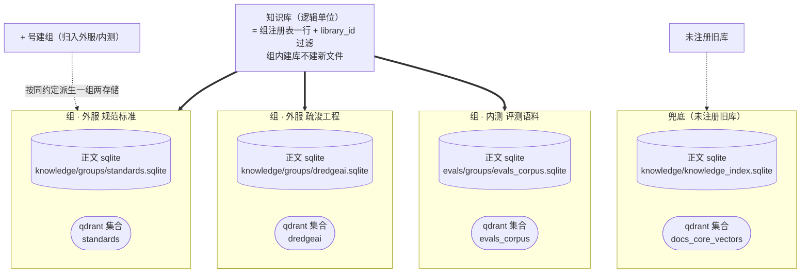
```mermaid
flowchart TB
    LIB["知识库（逻辑单位）<br/>= 组注册表一行 + library_id 过滤<br/>组内建库不建新文件"]
    subgraph G1["组 · 外服 规范标准"]
        direction LR
        S1[("正文 sqlite<br/>knowledge/groups/standards.sqlite")]
        V1(["qdrant 集合<br/>standards"])
    end
    subgraph G2["组 · 外服 疏浚工程"]
        direction LR
        S2[("正文 sqlite<br/>knowledge/groups/dredgeai.sqlite")]
        V2(["qdrant 集合<br/>dredgeai"])
    end
    subgraph G3["组 · 内测 评测语料"]
        direction LR
        S3[("正文 sqlite<br/>evals/groups/evals_corpus.sqlite")]
        V3(["qdrant 集合<br/>evals_corpus"])
    end
    NEW["+ 号建组（归入外服/内测）"] -. 按同约定派生一组两存储 .-> G1
    LIB ==> G1 & G2 & G3
    subgraph G0["兜底（未注册旧库）"]
        direction LR
        S0[("正文 sqlite<br/>knowledge/knowledge_index.sqlite")]
        V0(["qdrant 集合<br/>docs_core_vectors"])
    end
    LEGACY["未注册旧库"] -.-> G0
```

柱形=正文 sqlite，胶囊=向量集合：每个组恰好一套，互不共文件。

### 3.3 知识图谱模块

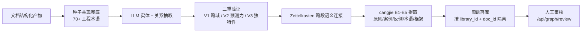
```mermaid
flowchart LR
    DOC["文档结构化产物"] --> SEED["种子共现兜底<br/>70+ 工程术语"]
    SEED --> LLM1["LLM 实体 + 关系抽取"]
    LLM1 --> V3["三重验证<br/>V1 跨域 / V2 预测力 / V3 独特性"]
    V3 --> ZK["Zettelkasten 跨段语义连接"]
    ZK --> E5["cangjie E1-E5 提取<br/>原则/案例/反例/术语/框架"]
    E5 --> DB["图谱落库<br/>按 library_id + doc_id 隔离"]
    DB --> REV["人工审核<br/>/api/graph/review"]
```

### 3.4 自进化模块（Dream Cycle）

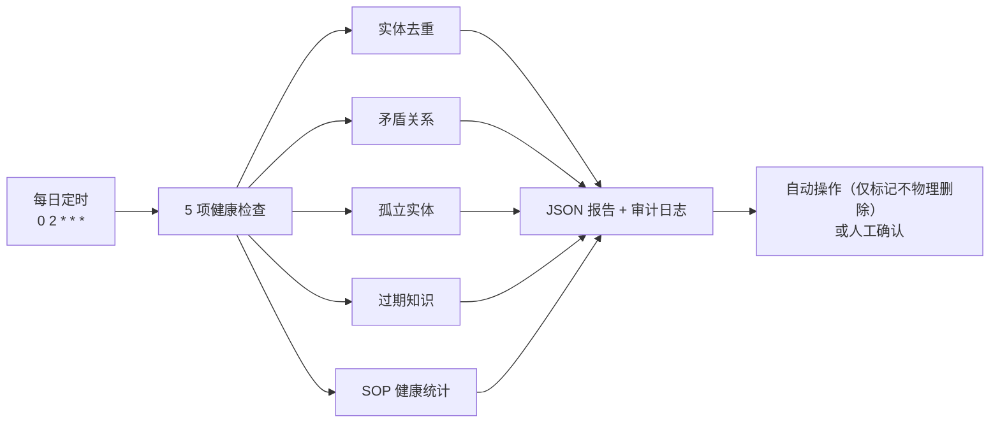
```mermaid
flowchart LR
    CRON["每日定时<br/>0 2 * * *"] --> CHK["5 项健康检查"]
    CHK --> DEDUP["实体去重"]
    CHK --> CTRD["矛盾关系"]
    CHK --> ORPH["孤立实体"]
    CHK --> STALE["过期知识"]
    CHK --> SOPH["SOP 健康统计"]
    DEDUP & CTRD & ORPH & STALE & SOPH --> RPT["JSON 报告 + 审计日志"]
    RPT --> ACT["自动操作（仅标记不物理删除）<br/>或人工确认"]
```

> 深入阅读：[angineer-docs/parse-pipeline.md](angineer-docs/parse-pipeline.md) · [angineer-docs/popo-pipeline.md](angineer-docs/popo-pipeline.md) · [knowledge-data-model.md](knowledge-data-model.md)

### 3.5 公开基准成绩

docs 是本项目最成熟、也是最基础的能力：全链路两端各有第三方公开基准背书——**语料端**用 OmniDocBench 证明「送进检索的语料是对的」，**回答端**用 Open RAG Bench 1040 题证明「答得出来且答得对」。两端各自独立可复现，这是结构化 RAG（区别于纯向量 RAG）可行性的双端数据支撑。

#### (1) 语料成绩——OmniDocBench v1.6 官方口径

公开文档解析基准 1651 页中抽样 1000 页（seed=42），现行基线为 2026-09-26 run `20260926-1305`。

**markdown 交付面与上游 MinerU 重合**（A① 官方口径，同 1000 页集合三方同尺对比）：我们的 markdown 是 MinerU 块的保真重渲染，表格/公式同源同分、六项差 ≤0.2pp——与参考模型的剩余差距是底层模型能力差距，不是本管线的损耗（越低越好的 Edit_dist 已转 `1−x` 百分制）：


**结构化强于上游 MinerU**（A②，canonical jsonl 直比口径，即检索实际消费的那一层）——块召回、文本相似度、阅读顺序全面领先 MinerU 原生 content_list：

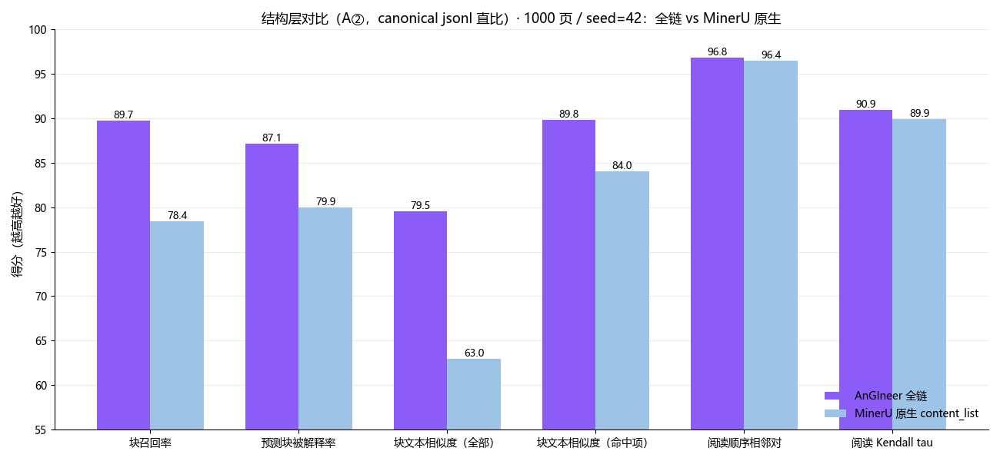

#### (2) 入库正确性——每晚素材体检（B 层）

结构化产物到检索素材的每一环都有断言盯着：解析产物 jsonl → canonical/chunk → 向量，逐文档核对「内容原样送到检索层」。每晚评测开跑前自动体检，2026-09-26 读数——349 篇、内容未落地 0 块、块→chunk 覆盖 99.99%、chunk→向量无缺口，连续 7 晚 ok。**数据正确入库不是一次性验收，是每晚重验的断言**；口径与判定表见 [parse-struct-eval.md](parse-struct-eval.md)。

#### (3) 回答成绩——Open RAG Bench v4 基线（nightly 门禁）

**对比臂**：同一份 1040 题、同一个语料库、同一个判分引擎（生成模型两臂同为 Qwen3.6-35B），通用配方的朴素 RAG（固定切片 → 向量 top-5 → 直答，无结构化、无融合重排、无守卫）可答题正确率仅 71.1%——**全链领先 17.5 个百分点**，而两者文档级检索命中率几乎持平（96.5% vs 96.0%）：


Vectara Open RAG Bench 官方 3045 题分层抽样（seed=42）为 **v4 = 1040 题 / 188 篇**（1001 可答 + 39 拒答，全库检索），判分引擎 DeepEval，2026-09-24 起为现行 nightly 门禁基线（快照钉在服务器 `data/evals/baseline/`，不进 git）：

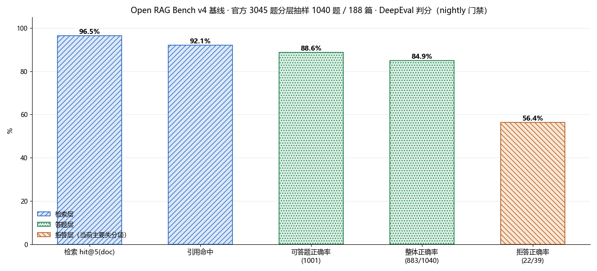

- 拒答正确率是当前主要失分项（09-27 归因读数：17 题跨文档错配作答）；现已升级两级观测口径——**有据未拒/真幻觉** ＋ **内容对/错/边界**（§5.3，随本版 v0.2.96 上线），逐题归因见 [report-refusal-attribution-20260927.md](report-refusal-attribution-20260927.md)；
- 官方榜单（Vectara 托管于 HuggingFace Space）与本仓口径不同——子集与判分引擎均不一致，**不作直接对比**，只引用本仓可复现基线。

**跨领域旁证——FinanceBench（金融域，同一判分链零改动）**：SEC 申报文件 84 篇 PDF 走自家解析管线入库、官方 150 题作答，语义正确率 **58.0%**（87/150，DeepEval）——超过论文（arXiv 2311.11944）公开的现实 RAG 配置最优档 50%；论文柱为人工复核口径，**判分方式不同、并列呈现非同一把尺**，oracle（金证据页）85% 档只作上限引用不作对比。文档级检索命中 96%，判分失败 0 题；预注册（跑前判据写死）与逐题归因见 [plan-financebench-arms.md](plan-financebench-arms.md)：


---

## 4. AnGIneer-SOPs 经验库模块

### 4.1 SOP 自动生成链路

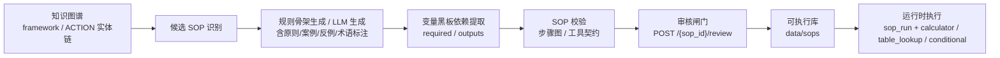
```mermaid
flowchart LR
    GRAPH["知识图谱<br/>framework / ACTION 实体链"] --> CAND["候选 SOP 识别"]
    CAND --> GEN["规则骨架生成 / LLM 生成<br/>含原则/案例/反例/术语标注"]
    GEN --> BB["变量黑板依赖提取<br/>required / outputs"]
    BB --> VAL["SOP 校验<br/>步骤图 / 工具契约"]
    VAL --> REV2["审核闸门<br/>POST /{sop_id}/review"]
    REV2 --> LIB["可执行库<br/>data/sops"]
    LIB --> RUN["运行时执行<br/>sop_run + calculator / table_lookup / conditional"]
```

### 4.2 主要能力

| 能力 | 说明 |
| :--- | :--- |
| 自动生成 | 从文档图谱识别 framework 路径或 ACTION 实体链生成 SOP JSON |
| 解析引擎 | Markdown SOP → 结构化执行计划（6 种工具类型） |
| 条件分支 | 精确匹配 → 排除法 → LLM 语义匹配三级降级 |
| 审核与审计 | LLM 生成的 SOP 需审核后才进入可执行库，全程留痕 |

---

## 5. AnGIneer-Evals 评测引擎模块

### 5.1 评测链路

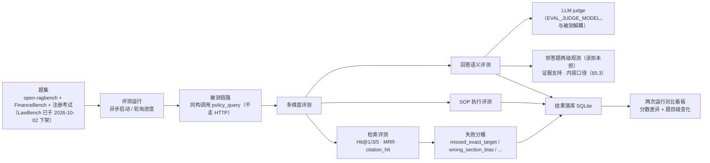
```mermaid
flowchart LR
    DS["题集<br/>open-ragbench + FinanceBench + 注册考试<br/>（LawBench 已于 2026-10-02 下架）"] --> RUN["评测运行<br/>异步启动 / 轮询进度"]
    RUN --> PIPE["被测链路<br/>同构调用 policy_query（不走 HTTP）"]
    PIPE --> MET["多维度评测"]
    MET --> RET["检索评测<br/>Hit@1/3/5 · MRR · citation_hit"]
    MET --> SOPE["SOP 执行评测"]
    MET --> ANS["回答语义评测"]
    ANS --> JUDGE["LLM judge（EVAL_JUDGE_MODEL，与被测解耦）"]
    ANS --> REFJ["拒答题两级观测（该拒未拒）<br/>证据支持 · 内容口径（§5.3）"]
    RET --> BUCKET["失败分桶<br/>missed_exact_target / wrong_section_bias / ..."]
    BUCKET & SOPE & ANS --> STORE["结果落库 SQLite"]
    STORE --> CMP["两次运行对比看板<br/>分数差异 + 题目级变化"]
```

> 深入阅读：[angineer-docs/retrieval-chain.md](angineer-docs/retrieval-chain.md)（检索评测指标与失败分桶的踩坑记录）

### 5.2 语义判分与被测模型解耦（judge）

回答语义判分（`answer_eval.py::_llm_semantic_evaluate`，AnswerEvaluator / SopEvaluator 共用唯一入口）默认走被测默认模型自评。自评存在**同源偏差**：judge 与被测同模型时，评分尺度随模型精度漂移——换量化/换模型后的分数差无法区分"作答变差"与"judge 变严"。

- `EVAL_JUDGE_MODEL`：在 `LLM_CONFIGS` 注册独立 judge 模型（如 Qwen3.8-Flash），设此变量后判分统一走它；不设则回退默认模型（向后兼容）
- **实证（2026-09-03/04）**：LLM 自 FP8 切 NVFP4，open-ragbench v2 自评差 -3.1pt；用固定 judge 重判两 run 全部 57 个争议题后 **NVFP4 反超 +3.6pt**（60.7% vs 57.1%）——确认自评 -3pt 为同源偏差，模型质量实际持平略优
- 检索评测（hit@1/3/5）为纯指标计算，不经 LLM judge

### 5.3 拒答题的两级观测判定（该拒未拒时）

该拒未拒的答案不再只按「未拒即失败」一刀切：判分器在其上追加两级**观测**判定，把"失败"拆开归因——①**证据支持**：答案核心主张是否被本轮检索证据支撑 → `refusal_miss_grounded`（有据未拒，拒答前提不成立）/ `refusal_miss_unsupported`（真幻觉）；②**内容口径**：与题集公开 gold 的一致性三档 `correct / wrong / uncertain`（预注册 rubric、温度 0；题集无 `content_gold` 不判）→ `refusal_content_miss_rate`（下界）/ 上界（含边界档）。

- **口径不变原则**：两级判定只加观测字段，`score` / `refusal_correct` 永不改动——nightly 门禁与历史基线保持可比；判官失败一律不猜结果（`evaluated=false`，不进分子分母）。
- 汇总落 run summary 与 nightly 报告「拒答专项」行；题集侧需给拒答集挂公开 gold（`scripts/open_ragbench/add_refusal_content_gold.py`），**部署后重导题集生效**（旧 schema 导入会丢 `content_gold`）。
- 深入阅读：[report-refusal-underrefusal-content-judge-20261010.md](report-refusal-underrefusal-content-judge-20261010.md)

---

## 6. AnGIneer-AI 大模型统一路由模块

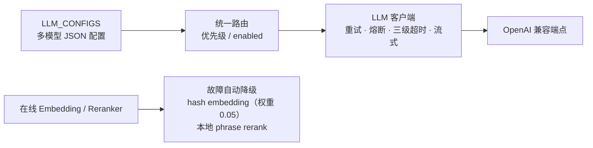
```mermaid
flowchart LR
    ENV["LLM_CONFIGS<br/>多模型 JSON 配置"] --> ROUTE["统一路由<br/>优先级 / enabled"]
    ROUTE --> CLIENT["LLM 客户端<br/>重试 · 熔断 · 三级超时 · 流式"]
    CLIENT --> UP["OpenAI 兼容端点"]
    EMB["在线 Embedding / Reranker"] --> DEG["故障自动降级<br/>hash embedding（权重 0.05）<br/>本地 phrase rerank"]
```

要点：`ai-inference` 是 AI 推理唯一真相源（零外部依赖）；Prompt 统一资产化（`prompts/` 带版本号注册），改动 prompt 必须升版本号，CI 强制审计。

> 深入阅读：[angineer-ai-inference/llm-gateway.md](angineer-ai-inference/llm-gateway.md)

---

## 7. 技术架构与仓库布局

### 7.1 依赖方向（强约束）

```text
ai-inference（AI 推理唯一真相源，零外部依赖）
    ↑
angineer-core / docs-core / evals-core / sop-core / engtools / geo-core
    ↑
docs-api / aichat-api（服务网关）
    ↑
user-web / admin-web（用户界面层）
```

### 7.2 仓库布局

```text
apps/
  user-web/           用户工作台（知识库 / SOP / GIS / 对话）· 3005
  admin-web/          管理后台（知识库 / 评测 / SOP / API Key / Dream Cycle）· 3002
  shared/             端口契约 ports.json + API 客户端
packages/
  docs-ui/  aichat-ui/  evals-ui/  sop-ui/  geo-ui/  engtools-ui/  ui-kit/  共享 UI 与组件（docs-ui、aichat-ui 亦独立发版）
  smartree/            通用树组件 SmartTree（独立仓库 angineer-smartree-ui）
  table-ui/            通用表格组件 DataTable（独立仓库 angineer-table-ui）
services/
  ai-inference/       LLM 客户端（多模型/重试/熔断/流式）+ 响应解析（唯一底座 · 独立仓库 angineer-ai-inference · PyPI）
  tree-core/          通用树节点 CRUD/移动/排序归一化（唯一底座 · 独立仓库 angineer-tree-core · PyPI）
  angineer-core/      意图分类、L0-L4 调度、Agent 循环、SOP 执行引擎、Prompt 资产（独立仓库 angineer-core · PyPI）
  docs-core/          一体化解析管线（九阶段）、五路检索、图谱、维护、导出（PoPo 随包 · 独立仓库 angineer-docs-core · PyPI）
  sop-core/           SOP 解析/校验/加载/自动生成
  evals-core/         题集管理、评测运行、结果对比、nightly 流水线（算法真相源）
  geo-core/           GIS 工程计算工具
  engtools/           计算器/查表/条件/知识检索/文档检索工具注册表
  chat-history/       聊天历史存储（sqlite）与路由（v0.2.67 起）
  shared/             服务间共享代码
  docs-api/           文档解析/知识库/图谱/v1/Key 管理（8790）
  aichat-api/         对话/模型配置/SOP/Evals/DreamCycle/nightly 调度（8791）
data/
  registry.sqlite     库组注册表（组→collection/sqlite 路由）
  knowledge/          生产知识域：knowledge_meta/index（回退单文件）、groups/<组>.sqlite、libraries/<库>/ 解析产物、graph.sqlite、parse_records.sqlite
  evals/              评测域：评测 SQLite 与题集 JSON、originals/<bench>/ 语料原件、corpora/libraries/<库>/ 评测库解析产物、groups/evals_corpus.sqlite
  platform/           运行时域：chat/users/api_keys/sops
  dream_cycle/        巡检报告与审计日志
tests/  docs/  scripts/  docker/
```

---

## 9. 路线图

| 版本 | 主题 | 核心能力 | 状态 |
| :--- | :--- | :--- | :--- |
| **v0.1** | 基础框架 | 文档解析入库、知识图谱、SOP 引擎、L0–L4 意图分级、AI 对话、评测框架 | ✅ 已完成（git tag `v0.1-frontend-*`） |
| **v0.2** | Docs 模块完成 | 高质量文档结构化 pipeline（OmniDocBench 三方同尺背书）、高质量知识库问答（Open RAG Bench 1040 题 nightly 门禁）、nightly 健康夜检、对外公开网站 angineer.cn | 🔄 迭代中：当前 v0.2.95，预计收版 v0.2.99 |
| **v0.3** | SOP 自进化 | SOP 自进化机制支撑各专业注册考题（图谱自动生成 → 审核闸门 → 执行轨迹反哺），网站开辟注册考题分支 | 🚧 规划中（自动生成链路骨架已存在，见 §4.1） |
| **v0.4** | GIS × CAD | 与 GIS、CAD 结合可做计算：真实空间数据接入（影像/地形/水文气象）、断面/土方等工程计算、DWG/DXF 读写与自动出图算量 | 🚧 规划中（geo-core 骨架已存在） |
| **v0.5** | 报告编制 | 基于规范检索、SOP 执行轨迹与 GIS/CAD 计算结果，自动编制工可、初设等正式设计报告（Markdown / Word / PDF 导出，支持人工复核） | 🚧 规划中 |
| **v1.0** | 正式版迭代 | 在 v0.5 基础上大量迭代：多专业覆盖、精度与稳定性、工程化与 SaaS 化（多租户） | 🚧 目标 |

> 说明：v0.3–v0.5 描述的是路线目标；当前实际代码基线以根 README「当前版本」一节为准，相关骨架模块已在对应小节标注，避免与已落地能力混淆。

---

## 10. 快速开始与部署

### 10.1 环境与配置

要求：Python 3.10+、Node.js 20+、pnpm 11（`packageManager` 已锁定 11.7.0）、LibreOffice（DOCX/PPTX/XLSX 转 PDF）。

```bash
git clone https://github.com/0mao0/AnGIneer.git
cd AnGIneer
pnpm install          # 前端依赖（start.ps1 首启会自动执行这步）
pnpm services:install # 后端 Python 依赖（含 evals-core）

cp .env.example .env   # Windows PowerShell: Copy-Item .env.example .env
```

`.env` 至少配置（均为 JSON 数组，顺序=优先级，失败自动切换下一项）：

- `LLM_CONFIGS`（显示名 / model / api_key / base_url / priority）
- `MINERU_CONFIGS`（文档解析端点）
- `EMBEDDING_CONFIGS`（向量端点）
- `RERANKER_CONFIGS`（重排端点）
- `POPO_CONFIGS`（可选，PoPo 强化端点）

### 10.2 Windows 一键启动（推荐）

```powershell
.\start.ps1              # 清理残留进程 → 启动后端 + 管理后台（含健康检查）→ 启动用户工作台
.\start.ps1 -TailLogs    # 跟踪 logs/backend.log 与 logs/admin.log
```

端口契约集中在 `apps/shared/ports.json`：docs-api `8790` · aichat-api `8791` · 用户台 `3005` · 管理台 `3002`。

### 10.3 手动启动（跨平台）

```bash
pnpm dev:backend    # docs-api: http://localhost:8790 · aichat-api: http://localhost:8791
pnpm dev:frontend   # 用户: http://localhost:3005
pnpm dev:admin      # 管理: http://localhost:3002
```

### 10.4 初始化 API Key 与外部 API 调用

管理后台 →「API 密钥」页面创建 Key（完整 Key 仅创建时显示一次），用于所有 `/api/v1/*` 接口的 `X-API-Key` 认证。

```bash
# 提交文档解析
curl -X POST http://localhost:8790/api/v1/documents/parse \
  -H "X-API-Key: ag_your_key_here" \
  -F "file=@document.pdf"

# 轮询解析状态
curl -H "X-API-Key: ag_your_key_here" \
  http://localhost:8790/api/v1/documents/{doc_id}/status

# 获取结构化 blocks
curl -H "X-API-Key: ag_your_key_here" \
  http://localhost:8790/api/v1/documents/{doc_id}/blocks

# 获取正文 / PDF / 产物清单
curl -H "X-API-Key: ag_your_key_here" \
  http://localhost:8790/api/v1/documents/{doc_id}/content
curl -H "X-API-Key: ag_your_key_here" \
  http://localhost:8790/api/v1/documents/{doc_id}/artifacts
```

支持格式：PDF 直接解析；DOCX / PPTX / XLSX 自动经 LibreOffice 转 PDF 后解析。

主要内部 API 分组：

| 前缀 | 能力 |
| :--- | :--- |
| `/api/knowledge/*` | 知识库/文档/解析任务/阶段重试/检索/结构化/编辑同步 |
| `/api/chat/agent` | Agent 化问答 SSE（`steer` / `cancel` 子端点） |
| `/api/sops/*` | SOP CRUD、导入、步骤解析、审核、审计、从文档生成 |
| `/api/graph/*` | 图谱统计/实体/关系/验证/审核/提取器 |
| `/api/evals/*` | 题集/题目/运行/对比 |
| `/api/dream-cycle/*` | 巡检报告/触发/审核确认 |
| `/api/v1/*` | 外部 API（文档解析/产物/内容，需 `X-API-Key`） |

### 10.5 评测与测试

```bash
# 全量 unittest
pnpm harness

# 端到端工作流（Q1 报告回归）
pnpm harness:workflow

# 工具注册测试
pnpm harness:tooling

# 列出评测题集
pnpm eval:list

# 评测冒烟门禁（20 正例 + 5 拒答，对比基线防回退；需服务已启动）
pnpm harness:eval-smoke
# 更新冒烟基线
python scripts/open_ragbench/run_smoke.py --update-baseline

# Prompt 资产审计（禁止源码内散落 prompt 字面量）
python scripts/audit_prompts.py
```

检索精度评测：导入 `data/evals/datasets/docs-retrieval-precision-v*.json` 基准集（《海港1》《海港2》《混凝土结构设计规范》），按 `hit@1/3/5`、MRR、citation_hit 与失败分桶回归。

### 10.6 Docker 部署

```bash
cd docker
docker compose up -d --build
```

- 前端（nginx）: `http://127.0.0.1:8080`（用户台 `/`，管理后台 `/admin/`；只绑回环）
- API: docs-api `http://127.0.0.1:8790`、aichat-api `http://127.0.0.1:8791`（均只绑定本机回环）
- Qdrant 向量库: `127.0.0.1:6333`（容器 `angineer-qdrant`，数据卷 `data/qdrant`）；ONLYOFFICE 文档预览: `8089`
- 数据卷：`../data`、`../logs`；API 密钥等配置来自 `../.env`

---

## 11. 开发约定与环境变量参考

### 11.1 多租户预留（tenant_id 规约）

当前为单租户形态，但所有持久化层**必须预留 `tenant_id` 字段**，为未来 SaaS 化避免 schema 迁移：

- 所有新建表必须包含 `tenant_id TEXT NOT NULL DEFAULT 'default'`，并建立联合索引 `(tenant_id, ...)`。
- 现有表暂不强行迁移；如有 schema 变更时顺带补上。
- 查询路径所有 list/get 接口预留 `tenant_id` 形参（默认 `'default'`），暂不启用过滤。
- 配置项：`ALLOWED_ORIGINS`、`DEFAULT_TENANT_ID`；上线时再启用 API Key → tenant_id 映射。

### 11.2 CORS 配置

生产/对外部署必须通过环境变量显式配置允许的前端来源，禁止使用 `*`：

```
ALLOWED_ORIGINS=https://docs.your-domain.com,https://admin.your-domain.com,https://angineer.cn
```

### 11.3 API Key 认证

所有 `/api/v1/*` 端点需在 Header 携带 `X-API-Key`；Key 通过管理后台 `/api/api-keys` 生成，存储于 `data/platform/api_keys.sqlite`。

### 11.4 Prompt 资产化

全部 prompt 的唯一资产区为 `services/angineer-core/src/angineer_core/prompts/`：源码中不允许出现 `你是一个` / `You are a` 等 prompt 字面量；每个 prompt 带版本号并在模块底部 `register(name, version, text)` 登记；**改动 prompt 必须递增版本号**；`scripts/audit_prompts.py` 在 CI 中强制审计。

### 11.5 依赖方向

- `ai-inference` 是 AI 推理的唯一真相源，零外部依赖；上层服务直接 `from ai_inference import ...`，不经过 angineer-core 中转。
- `tree-core` 是树操作唯一真相源，零外部依赖；各服务在自己的 SQLite 中创建 `tree_node` 表并调用 tree_core 操作。

### 11.6 环境变量参考

| 变量 | 说明 | 默认 |
| :--- | :--- | :--- |
| `LLM_CONFIGS` | LLM 模型配置 JSON 数组（唯一配置入口） | 见 `.env.example` |
| `ANGINEER_DEFAULT_MODEL` | 默认模型名 | `Qwen3.6-Plus` |
| `EVAL_JUDGE_MODEL` | 评测判分专用模型配置名（judge 与被测解耦，不设则用默认模型自评） | 空 |
| `AI_PROVIDER` | AI 服务商（aliyun 等） | `aliyun` |
| `MINERU_CONFIGS` | MinerU 解析端点数组（顺序=优先级，失败自动切换） | JSON 数组 |
| `MINERU_MAX_CONCURRENCY` | MinerU GPU 并发上限 | `1` |
| `MINERU_BACKEND` | MinerU 后端标识 | `hybrid-engine` |
| `EMBEDDING_CONFIGS` | Embedding 端点数组（顺序=优先级，链尾自动补 hash） | JSON 数组 |
| `DOCS_EMBEDDING_PROVIDER` | Embedding 提供方标识（bge_m3/dashscope/hash） | `bge_m3` |
| `DOCS_VECTORSTORE_PROVIDER` | 向量库类型（chroma/sqlite/qdrant；生产用 qdrant） | `chroma` |
| `RERANKER_CONFIGS` | Reranker 端点数组（顺序=优先级，失败自动切换） | JSON 数组 |
| `POPO_CONFIGS` | PoPo 强化 LLM 端点数组（顺序=优先级，失败自动切换） | JSON 数组 |
| `POPO_API_TIMEOUT` / `POPO_MAX_TOKENS` | PoPo 超时与最大 token | `300` / `4096` |
| `POPO_MAX_CONCURRENCY` | PoPo 4B 推理并发上限（打远端 vLLM） | `1` |
| `POPO_INFERENCE_RETRIES` | PoPo 推理瞬时失败重试次数 | `1` |
| `ANGINEER_GAP_ANALYSIS_ENABLED` | 回答知识盲区分析开关 | `true` |
| `ANGINEER_FOLLOWUP_QUESTION` | L1/L2 回答末尾追加追问（仅知识问答档生效） | `true` |
| `DREAM_CYCLE_ENABLED` / `DREAM_CYCLE_SCHEDULE` | 巡检开关与 cron | `true` / `0 2 * * *` |
| `DREAM_CYCLE_DEDUP_*` / `DREAM_CYCLE_ORPHAN_*` 等 | 巡检阈值 | 见 `step08_maintain/config.py` |
| `ALLOWED_ORIGINS` | CORS 白名单（逗号分隔） | 本地开发地址 |
| `DEFAULT_TENANT_ID` | 默认租户 | `default` |
| `API_KEYS_DB_PATH` | API Key 数据库路径 | `data/platform/api_keys.sqlite` |
| `ANGINEER_LOG_LEVEL` | 日志级别 | `INFO` |
