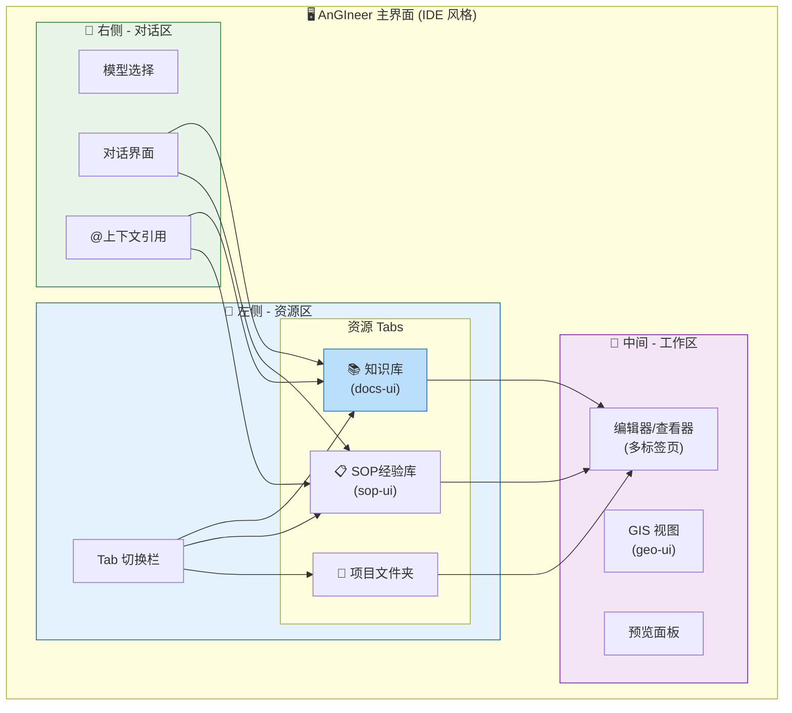
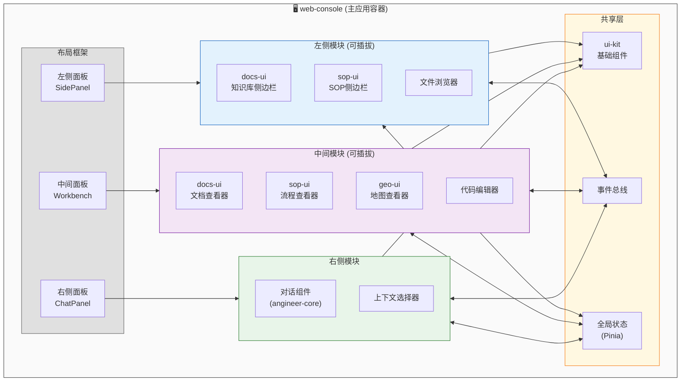
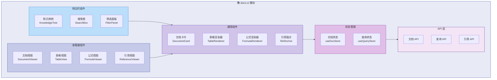
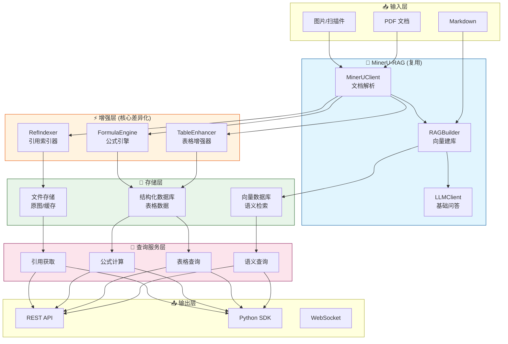
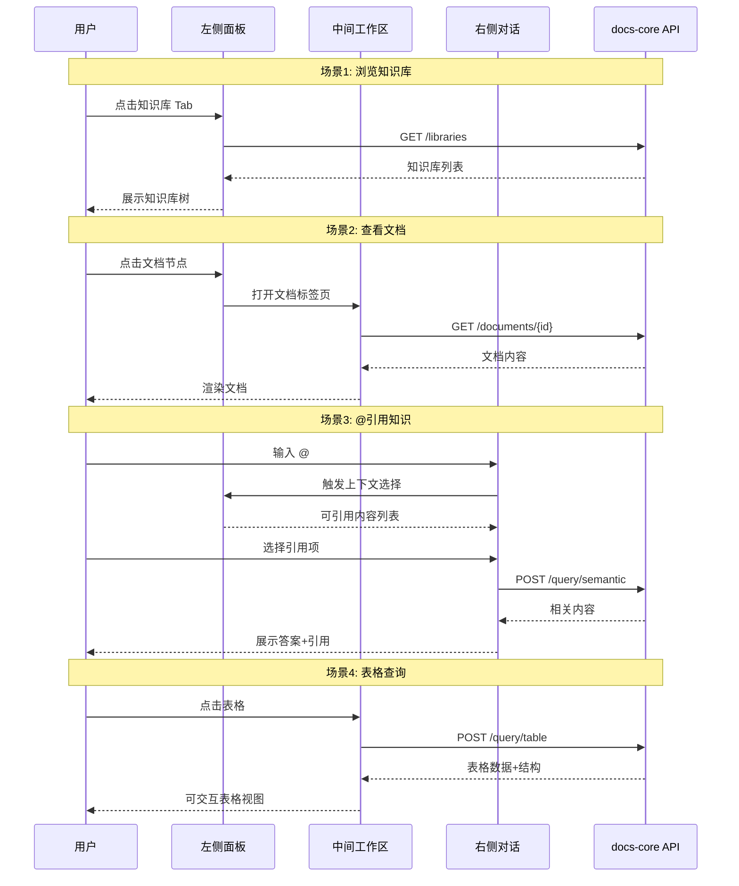
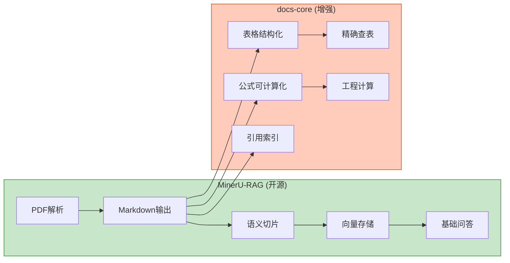
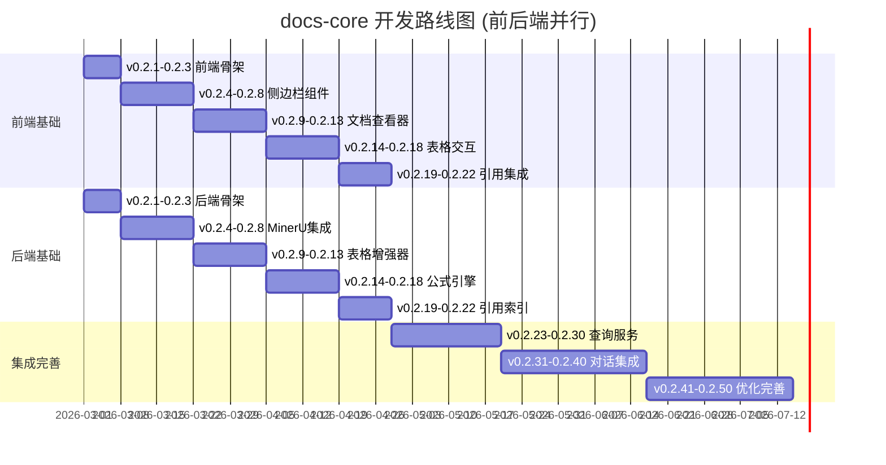

# AnGIneer Docs Core

> 工程规范知识库核心引擎 —— 让规范文档"可读、可查、可算、可引用"

## 📌 模块定位

`docs-core` 是 AnGIneer 的**知识基础设施**，负责工程规范文档的解析、增强、存储与查询。它既作为 AnGIneer 的核心模块，也可独立部署为通用的**规范文档智能平台**。

### 核心价值

| 能力 | 描述 | 差异化 |
|------|------|--------|
| 📖 **可读** | 高保真解析 PDF，保留结构、公式、图表 | 基于 MinerU |
| 🔍 **可查** | 语义检索 + 表格精确查询 | 双轨查询 |
| 🧮 **可算** | 公式解析与计算、表格插值 | 工程计算 |
| 📎 **可引用** | 条文、表格、图片的精确引用 | 块级溯源 |

### 与其他模块的关系

```
┌─────────────────────────────────────────────────────────────┐
│                        AnGIneer                             │
├─────────────────────────────────────────────────────────────┤
│                                                             │
│  ┌─────────────┐    ┌─────────────┐    ┌─────────────┐     │
│  │  sop-core   │───▶│  docs-core  │◀───│  engtools   │     │
│  │  (流程引擎)  │    │  (知识引擎)  │    │  (计算工具)  │     │
│  └─────────────┘    └─────────────┘    └─────────────┘     │
│         │                  │                  │             │
│         └──────────────────┼──────────────────┘             │
│                            ▼                                │
│                   ┌─────────────┐                          │
│                   │ angineer-   │                          │
│                   │   core      │                          │
│                   │ (LLM调度)   │                          │
│                   └─────────────┘                          │
│                                                             │
└─────────────────────────────────────────────────────────────┘
```

---

## 🏗️ 整体架构

### AnGIneer IDE 风格界面布局



### 前端模块集成架构



### docs-ui 组件架构



### 后端架构



### 前后端交互



---

## 🔗 与 MinerU-RAG 的关系

### 能力复用与增强



### 复用比例

| 功能模块 | 复用 MinerU | 自研增强 | 说明 |
|---------|------------|---------|------|
| PDF 解析 | ✅ 100% | - | 直接使用 MinerUClient |
| Markdown 输出 | ✅ 100% | - | 高保真输出 |
| 语义切片 | ✅ 80% | 20% | 保留块边界信息 |
| 向量存储 | ✅ 100% | - | 使用 RAGBuilder |
| 基础问答 | ✅ 100% | - | 使用 LLMClient |
| 表格处理 | ❌ 0% | ✅ 100% | **核心差异化** |
| 公式计算 | ❌ 0% | ✅ 100% | **核心差异化** |
| 引用溯源 | ⚠️ 30% | ✅ 70% | 增强块级索引 |

**结论**: MinerU-RAG 解决了 80% 的通用问题，docs-core 专注 20% 的工程规范差异化能力。

---

## 📦 目录结构

### 后端 (services/docs-core)

```
services/docs-core/
├── src/
│   └── docs_core/
│       ├── parser/              # 文档解析
│       │   ├── mineru_client.py     # MinerU 封装
│       │   └── block_parser.py      # 块解析器
│       │
│       ├── enhancer/            # 增强器 (核心)
│       │   ├── base.py              # 增强器基类
│       │   ├── registry.py          # 注册中心
│       │   ├── table/               # 表格增强
│       │   │   ├── simple.py            # 简单查值表
│       │   │   ├── conditional.py       # 条件查询表
│       │   │   ├── interpolation.py     # 插值计算表
│       │   │   └── chart.py             # 图形式表格
│       │   ├── formula/             # 公式增强
│       │   │   ├── parser.py            # 公式解析
│       │   │   └── calculator.py        # 公式计算
│       │   └── reference/           # 引用增强
│       │       └── indexer.py           # 引用索引
│       │
│       ├── storage/             # 存储层
│       │   ├── vector_store.py      # 向量存储
│       │   ├── structured_store.py  # 结构化存储
│       │   └── file_store.py        # 文件存储
│       │
│       ├── query/               # 查询服务
│       │   ├── semantic.py          # 语义查询
│       │   ├── table.py             # 表格查询
│       │   ├── formula.py           # 公式计算
│       │   └── reference.py         # 引用获取
│       │
│       ├── api/                 # API 层
│       │   ├── routes.py            # 路由定义
│       │   └── schemas.py           # 数据模型
│       │
│       └── __init__.py
│
├── tests/
│   ├── unit/
│   ├── integration/
│   └── fixtures/
│
├── pyproject.toml
└── README.md
```

### 前端 (packages/docs-ui)

```
packages/docs-ui/
├── src/
│   ├── components/              # 组件
│   │   ├── sidebar/                 # 侧边栏组件
│   │   │   ├── KnowledgeTree.vue        # 知识库树
│   │   │   ├── SearchBox.vue            # 搜索框
│   │   │   └── FilterPanel.vue          # 筛选面板
│   │   ├── viewer/                  # 查看器组件
│   │   │   ├── DocumentViewer.vue       # 文档视图
│   │   │   ├── TableView.vue            # 表格视图
│   │   │   ├── FormulaViewer.vue        # 公式视图
│   │   │   └── ReferenceViewer.vue      # 引用视图
│   │   └── common/                  # 通用组件
│   │       ├── DocumentCard.vue         # 文档卡片
│   │       ├── TableRenderer.vue        # 表格渲染器
│   │       ├── FormulaRenderer.vue      # 公式渲染器
│   │       └── RefAnchor.vue            # 引用锚点
│   │
│   ├── composables/             # 组合式函数
│   │   ├── useDocument.ts           # 文档操作
│   │   ├── useQuery.ts              # 查询操作
│   │   └── useRefAnchor.ts          # 引用操作
│   │
│   ├── stores/                  # 状态管理
│   │   ├── documentStore.ts         # 文档状态
│   │   └── queryStore.ts            # 查询状态
│   │
│   ├── api/                     # API 层
│   │   ├── document.ts              # 文档 API
│   │   ├── query.ts                 # 查询 API
│   │   └── reference.ts             # 引用 API
│   │
│   ├── types/                   # 类型定义
│   │   ├── document.ts
│   │   ├── table.ts
│   │   └── reference.ts
│   │
│   ├── styles/                  # 样式
│   │   └── index.less
│   │
│   └── index.ts                 # 入口
│
├── package.json
└── README.md
```

---

## 🗓️ 开发计划

### 版本规划总览



### 详细里程碑

#### Phase 1: 基础骨架 (v0.2.1 - v0.2.3) [前后端并行]

| 版本 | 前端目标 | 后端目标 |
|------|---------|---------|
| v0.2.1 | docs-ui 项目初始化、目录结构 | docs-core 项目初始化、pyproject.toml |
| v0.2.2 | 基础组件框架、路由配置 | 核心数据模型定义 |
| v0.2.3 | 与 web-console 集成测试 | API 骨架、Mock 数据 |

#### Phase 2: 核心功能 (v0.2.4 - v0.2.8) [前后端并行]

| 版本 | 前端目标 | 后端目标 |
|------|---------|---------|
| v0.2.4 | KnowledgeTree 组件 | MinerUClient 封装 |
| v0.2.5 | SearchBox 组件 | PDF 解析测试 |
| v0.2.6 | FilterPanel 组件 | Markdown 块解析 |
| v0.2.7 | 侧边栏集成调试 | 增强器框架 |
| v0.2.8 | 侧边栏样式优化 | 表格分类器 |

#### Phase 3: 文档/表格 (v0.2.9 - v0.2.18) [前后端并行]

| 版本 | 前端目标 | 后端目标 |
|------|---------|---------|
| v0.2.9 | DocumentViewer 组件 | 简单表处理 |
| v0.2.10 | Markdown 渲染 | 条件表处理 |
| v0.2.11 | 公式渲染 (KaTeX) | 区间匹配算法 |
| v0.2.12 | 图片预览 | 插值表处理 |
| v0.2.13 | 文档标签页管理 | 插值算法实现 |
| v0.2.14 | TableRenderer 组件 | 图形式表格 |
| v0.2.15 | 表格参数输入 | 表格存储 |
| v0.2.16 | 表格结果展示 | 表格查询 API |
| v0.2.17 | 表格插值交互 | 公式解析器 |
| v0.2.18 | 表格导出功能 | 公式计算引擎 |

#### Phase 4: 引用系统 (v0.2.19 - v0.2.22) [前后端并行]

| 版本 | 前端目标 | 后端目标 |
|------|---------|---------|
| v0.2.19 | RefAnchor 组件 | 块标识生成 |
| v0.2.20 | 引用跳转功能 | 位置索引 |
| v0.2.21 | 引用复制功能 | 引用解析 |
| v0.2.22 | 引用预览浮层 | 引用存储 |

#### Phase 5: 查询服务 (v0.2.23 - v0.2.30) [集成开发]

| 版本 | 目标 | 交付物 |
|------|------|--------|
| v0.2.23 | 语义查询集成 | 前端调用 RAGBuilder |
| v0.2.24 | 查询结果展示 | 结果列表组件 |
| v0.2.25 | 混合查询 | 语义+表格混合 |
| v0.2.26 | 查询历史 | 历史记录功能 |
| v0.2.27 | 查询缓存 | 前端缓存优化 |
| v0.2.28 | 批量查询 | 批量接口实现 |
| v0.2.29 | 查询导出 | 导出报告功能 |
| v0.2.30 | 查询测试 | E2E 测试 |

#### Phase 6: 对话集成 (v0.2.31 - v0.2.40) [核心集成]

| 版本 | 目标 | 交付物 |
|------|------|--------|
| v0.2.31 | @提及功能 | 上下文选择器 |
| v0.2.32 | 知识库选择 | 多知识库切换 |
| v0.2.33 | 引用注入 | 对话携带引用上下文 |
| v0.2.34 | 答案溯源 | 回答来源展示 |
| v0.2.35 | 表格@查询 | @表格直接查询 |
| v0.2.36 | 公式@计算 | @公式直接计算 |
| v0.2.37 | 引用@跳转 | @引用直接跳转 |
| v0.2.38 | 对话历史 | 对话记录管理 |
| v0.2.39 | 对话导出 | 对话导出报告 |
| v0.2.40 | 对话测试 | 集成测试 |

#### Phase 7: 优化完善 (v0.2.41 - v0.2.50)

| 版本 | 目标 | 交付物 |
|------|------|--------|
| v0.2.41 | 性能优化 | 虚拟滚动、懒加载 |
| v0.2.42 | 错误处理 | 友好错误提示 |
| v0.2.43 | 国际化 | i18n 支持 |
| v0.2.44 | 主题定制 | 主题切换 |
| v0.2.45 | 快捷键 | 键盘操作支持 |
| v0.2.46 | 无障碍 | a11y 优化 |
| v0.2.47 | 移动适配 | 响应式布局 |
| v0.2.48 | 文档完善 | API 文档、使用指南 |
| v0.2.49 | 测试覆盖 | 测试覆盖率 >80% |
| v0.2.50 | 发布准备 | 发布检查、版本号更新 |

---

## 🔌 前端集成指南

### 与 web-console 的集成

#### 1. 注册侧边栏模块

```typescript
import { createDocsSidebar } from '@angineer/docs-ui'
import { useSidebarStore } from '@angineer/web-console'

const sidebarStore = useSidebarStore()

sidebarStore.registerModule({
  id: 'knowledge-base',
  label: '知识库',
  icon: 'BookOutlined',
  component: createDocsSidebar(),
  order: 1
})
```

#### 2. 注册工作区视图

```typescript
import { DocumentViewer, TableView } from '@angineer/docs-ui'
import { useWorkbenchStore } from '@angineer/web-console'

const workbenchStore = useWorkbenchStore()

workbenchStore.registerViewer({
  type: 'document',
  component: DocumentViewer,
  extensions: ['md', 'pdf']
})

workbenchStore.registerViewer({
  type: 'table',
  component: TableView,
  extensions: ['table']
})
```

#### 3. 注册上下文提供者

```typescript
import { DocsContextProvider } from '@angineer/docs-ui'
import { useContextStore } from '@angineer/web-console'

const contextStore = useContextStore()

contextStore.registerProvider({
  id: 'docs',
  label: '知识库',
  provider: DocsContextProvider,
  trigger: '@'
})
```

### 事件通信

```typescript
import { useEventBus } from '@angineer/web-console'

const eventBus = useEventBus()

eventBus.on('docs:open', (docId: string) => {
  workbenchStore.openTab({ type: 'document', id: docId })
})

eventBus.on('docs:ref:selected', (ref: Reference) => {
  chatStore.appendContext(ref)
})
```

---

## 🚀 快速开始

### 后端安装

```bash
cd services/docs-core
pip install -e ".[dev]"
pip install mineru-rag[rag]
```

### 前端安装

```bash
cd packages/docs-ui
pnpm install
pnpm run dev
```

### 基础使用

```python
from docs_core import DocsEngine

engine = DocsEngine()
result = engine.process_document("规范文档.pdf", library_id="harbor_spec")
answer = engine.query("航道通航水深如何计算？")
value = engine.query_table(table_id="vessel-sinkage-table", params={"dwt": 10, "speed": 8})
ref = engine.get_reference("block-123")
```

---

## 📄 许可证

MIT License - 详见 [LICENSE](../../LICENSE)
